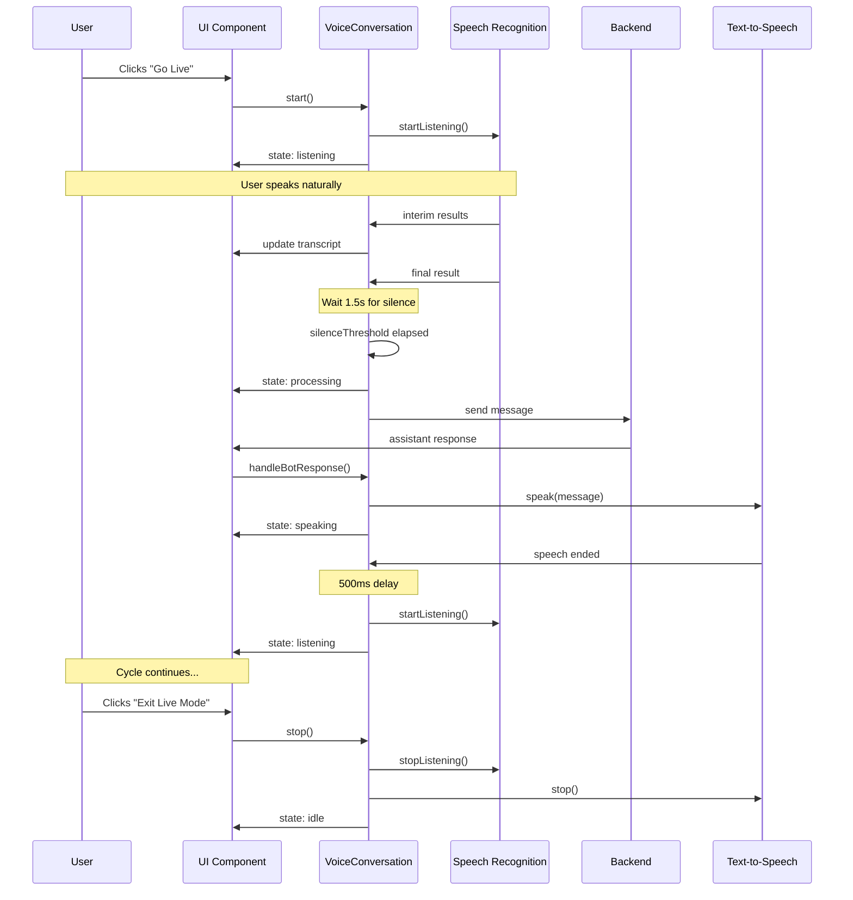

# Live Voice Mode - Visual Workflow

## State Diagram

```mermaid
graph TB
    Start([User Clicks "Go Live"]) --> Init[Initialize Voice Conversation]
    Init --> Listen[🎤 LISTENING State]
    
    Listen --> |User speaks| Interim[Show Interim Transcript]
    Interim --> |Still speaking| Interim
    Interim --> |Pause detected| Final[Final Transcript Received]
    
    Final --> |Wait 1.5s| CheckSilence{Silent for 1.5s?}
    CheckSilence --> |Yes| Send[Auto-Send Message]
    CheckSilence --> |No, more speech| Interim
    
    Send --> Process[🤔 PROCESSING State]
    Process --> |Bot responds| Speak[🔊 SPEAKING State]
    
    Speak --> |User interrupts| Interrupt[Stop TTS Immediately]
    Interrupt --> Listen
    
    Speak --> |Finishes naturally| AutoListen[Auto-restart Listening]
    AutoListen --> |500ms delay| Listen
    
    Listen --> |User exits| Stop([Exit Live Mode])
    Process --> |User exits| Stop
    Speak --> |User exits| Stop
    
    style Listen fill:#3b82f6,color:#fff
    style Process fill:#f59e0b,color:#fff
    style Speak fill:#10b981,color:#fff
    style Stop fill:#6b7280,color:#fff
```

## User Journey



## Component Architecture

```
┌────────────────────────────────────────────────────────────┐
│                     Browser Extension                      │
│                                                            │
│  ┌──────────────────────────────────────────────────┐    │
│  │            ConversationMode Component            │    │
│  │                                                  │    │
│  │  ┌────────────┐    ┌──────────────────────┐    │    │
│  │  │  "Go Live" │    │   Status Indicators  │    │    │
│  │  │   Button   │    │  🎤 🤔 🔊 ⏸️          │    │    │
│  │  └────────────┘    └──────────────────────┘    │    │
│  │                                                  │    │
│  │  ┌──────────────────────────────────────────┐  │    │
│  │  │      Live Transcript Display            │  │    │
│  │  │  "Finding the best deals on..."         │  │    │
│  │  └──────────────────────────────────────────┘  │    │
│  │                                                  │    │
│  └────────────┬─────────────────────────┬──────────┘    │
│               │                         │                │
│               ▼                         ▼                │
│  ┌───────────────────────┐  ┌──────────────────────┐   │
│  │ VoiceConversation     │  │  Message Handler     │   │
│  │ Service               │  │                      │   │
│  │                       │  │  • Chat messages     │   │
│  │ • State machine       │  │  • Bot responses     │   │
│  │ • Auto-send logic     │  │  • Intent detection  │   │
│  │ • Silence detection   │  │                      │   │
│  │ • Interrupt handling  │  └──────────────────────┘   │
│  │                       │                              │
│  └───────┬───────────┬───┘                              │
│          │           │                                  │
│          ▼           ▼                                  │
│  ┌──────────┐  ┌──────────┐                            │
│  │  STT     │  │   TTS    │                            │
│  │ Service  │  │ Service  │                            │
│  └──────────┘  └──────────┘                            │
│          │           │                                  │
└──────────┼───────────┼──────────────────────────────────┘
           │           │
           ▼           ▼
    ┌──────────────────────────┐
    │   Web Speech API         │
    │                          │
    │  • SpeechRecognition     │
    │  • SpeechSynthesis       │
    └──────────────────────────┘
```

## State Transitions

```
           ┌─────────────┐
           │    IDLE     │
           └──────┬──────┘
                  │ start()
                  ▼
           ┌─────────────┐
      ┌───►│  LISTENING  │◄───┐
      │    └──────┬──────┘    │
      │           │ final +   │
      │           │ silence   │
      │           ▼           │
      │    ┌─────────────┐   │
      │    │ PROCESSING  │   │
      │    └──────┬──────┘   │
      │           │ response │
      │           ▼           │
      │    ┌─────────────┐   │
      │    │  SPEAKING   │   │
      │    └──────┬──────┘   │
      │           │ ended    │
      └───────────┘          │
                             │
      Interrupt: SPEAKING ───┘
```

## Data Flow

```
User Speech
    │
    ▼
Microphone ──────► Web Speech API
    │                    │
    │              ┌─────┴─────┐
    │              ▼           ▼
    │         Interim      Final
    │         Results     Results
    │              │           │
    │              ▼           ▼
    │         Live        Pending
    │         Display     Transcript
    │                         │
    │                         │
    │                   ┌─────┴─────┐
    │                   │           │
    │                   ▼           ▼
    │              Wait 1.5s    More speech?
    │                   │           │
    │                   ▼           └─► Append
    │              Auto-send
    │                   │
    │                   ▼
    │              Backend API
    │                   │
    │                   ▼
    │              AI Processing
    │                   │
    │                   ▼
    │              Bot Response
    │                   │
    │                   ├─► Clean text
    │                   │
    │                   ▼
    │              Text-to-Speech
    │                   │
    └────────────────── ▼
                   Speakers
```

## Timing Diagram

```
Time (seconds)
│
0 ──► User: "Find the best deals on laptops"
│     [speaking... 3 seconds]
│
3 ──► [User stops speaking]
│     [Silence detection starts]
│
4.5 ─► [1.5s silence threshold met]
│     [Auto-send triggered]
│     [State: listening → processing]
│
5 ──► [Backend receives message]
│     [AI starts processing]
│
7 ──► [AI response ready]
│     [State: processing → speaking]
│     [TTS starts: "I'll help you find..."]
│
15 ─► [TTS finishes speaking]
│     [500ms delay]
│
15.5 ► [Auto-restart listening]
│     [State: speaking → listening]
│     [Ready for next input]
│
```

## Error Handling Flow

```
Error Occurs
    │
    ├─── STT Error
    │      ├─► Log error
    │      ├─► Show error message
    │      ├─► Wait 1s
    │      └─► Retry listening
    │
    ├─── TTS Error
    │      ├─► Log error
    │      ├─► Show error message
    │      └─► Skip to listening
    │
    └─── Network Error
           ├─► Log error
           ├─► Show error message
           ├─► Keep in processing state
           └─► Wait for retry/manual intervention
```

## Configuration Impact

```
silenceThreshold: 1500ms (default)
    │
    ├─► Too low (< 500ms)
    │      └─► Sends incomplete sentences
    │
    ├─► Optimal (1000-2000ms)
    │      └─► Natural conversation flow
    │
    └─► Too high (> 3000ms)
           └─► Feels sluggish, user waits

autoRestartListening: true/false
    │
    ├─► true (default)
    │      └─► Continuous conversation
    │
    └─► false
           └─► Manual restart needed

interruptOnSpeech: true/false
    │
    ├─► true (default)
    │      └─► Can interrupt AI
    │
    └─► false
           └─► Must wait for AI to finish
```

---

These diagrams show the complete flow of Live Voice Mode from start to finish!
