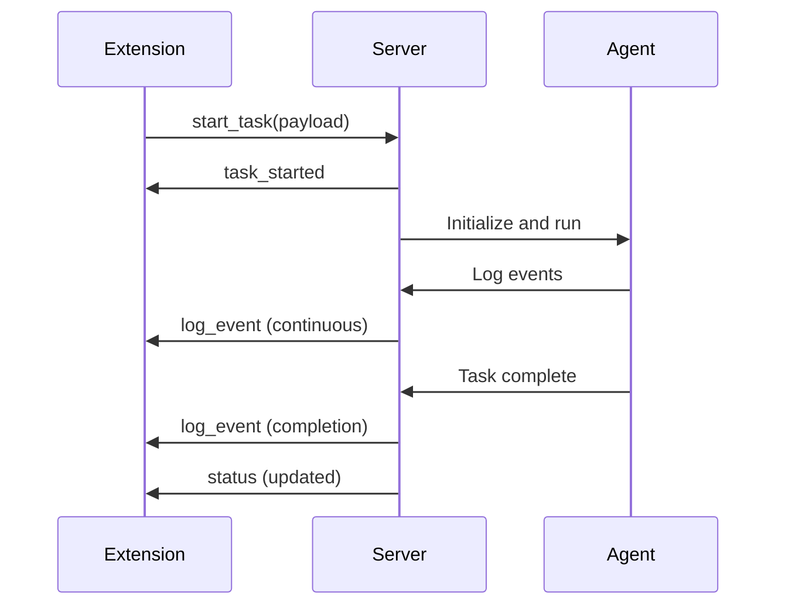
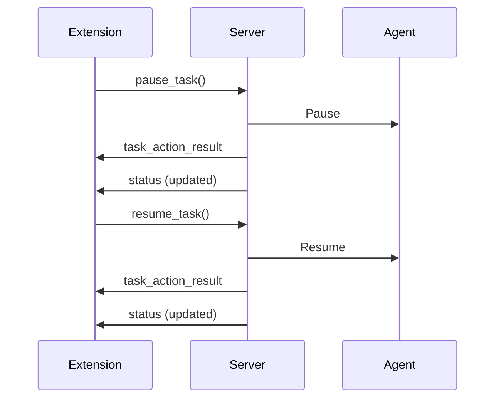
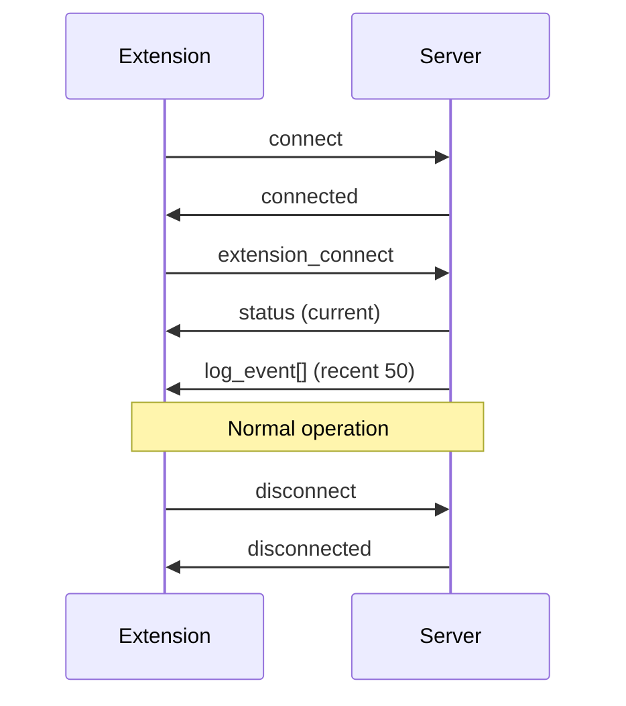

# Browser.AI WebSocket Protocol

## Overview

This document defines the WebSocket communication protocol between the Browser.AI Chrome extension and the Browser.AI server. The protocol ensures type-safe, consistent communication for task management, log streaming, and status updates.

## Connection Details

- **Namespace**: `/extension`
- **Transport**: WebSocket
- **Default Server URL**: `http://localhost:5000`
- **Reconnection**: Enabled (5 attempts, 1000ms delay)

## Protocol Files

- **TypeScript**: `browser_ai_extension/browse_ai/src/types/protocol.ts`
- **Python**: `browser_ai_gui/protocol.py`

## Data Structures

### LogEvent

Represents a log event broadcast from server to clients.

**TypeScript**:
```typescript
interface LogEvent {
  timestamp: string          // ISO 8601 format
  level: LogLevel | string   // DEBUG, INFO, WARNING, ERROR, RESULT
  logger_name: string        // Name of logger
  message: string            // Log message
  event_type: EventType | string  // Event type classification
  metadata?: Record<string, any>  // Optional additional data
}
```

**Python**:
```python
@dataclass
class LogEvent:
    timestamp: str
    level: str  # LogLevel value
    logger_name: str
    message: str
    event_type: str  # EventType value
    metadata: Optional[Dict[str, Any]] = None
```

### TaskStatus

Represents the current state of a running task.

**TypeScript**:
```typescript
interface TaskStatus {
  is_running: boolean
  current_task: string | null
  has_agent: boolean
  is_paused?: boolean
  cdp_endpoint?: string
}
```

**Python**:
```python
@dataclass
class TaskStatus:
    is_running: bool
    current_task: Optional[str]
    has_agent: bool
    is_paused: Optional[bool] = None
    cdp_endpoint: Optional[str] = None
```

### ActionResult

Generic result for task actions (stop, pause, resume).

**TypeScript**:
```typescript
interface ActionResult {
  success: boolean
  message?: string
  error?: string
}
```

**Python**:
```python
@dataclass
class ActionResult:
    success: bool
    message: Optional[str] = None
    error: Optional[str] = None
```

## Client → Server Events

### 1. extension_connect

**Description**: Sent when extension client connects to establish session

**Payload**: None

**Server Response**: 
- Emits `status` event with current TaskStatus
- Emits recent `log_event` events (last 50)

**Example**:
```typescript
socket.emit('extension_connect')
```

### 2. start_task

**Description**: Request to start a new Browser.AI task

**Payload**:
```typescript
interface StartTaskPayload {
  task: string              // Task description
  cdp_endpoint?: string     // Optional CDP WebSocket endpoint
  is_extension?: boolean    // Flag to indicate extension mode
}
```

**Server Response**:
- Emits `task_started` event
- Task runs asynchronously
- Progress updates via `log_event` broadcasts

**Example**:
```typescript
socket.emit('start_task', {
  task: 'Navigate to google.com and search for cats',
  cdp_endpoint: 'ws://localhost:9222/devtools/...',
  is_extension: true
})
```

**Error Cases**:
- Missing task description → `error` event with message
- Missing CDP endpoint (when required) → `error` event
- Task already running → `error` event

### 3. stop_task

**Description**: Request to stop the currently running task

**Payload**: None

**Server Response**: Emits `task_action_result` event with ActionResult

**Example**:
```typescript
socket.emit('stop_task')
```

### 4. pause_task

**Description**: Request to pause the currently running task

**Payload**: None

**Server Response**: Emits `task_action_result` event with ActionResult

**Example**:
```typescript
socket.emit('pause_task')
```

### 5. resume_task

**Description**: Request to resume a paused task

**Payload**: None

**Server Response**: Emits `task_action_result` event with ActionResult

**Example**:
```typescript
socket.emit('resume_task')
```

### 6. get_status

**Description**: Request current task status

**Payload**: None

**Server Response**: Emits `status` event with TaskStatus

**Example**:
```typescript
socket.emit('get_status')
```

## Server → Client Events

### 1. connect

**Description**: Standard Socket.IO connection event

**Payload**: None

**Usage**: Update UI connection status

### 2. disconnect

**Description**: Standard Socket.IO disconnection event

**Payload**: None

**Usage**: Update UI connection status

### 3. status

**Description**: Broadcast of current task status

**Payload**: TaskStatus object

**When Emitted**:
- On initial connection (after `extension_connect`)
- After status changes
- In response to `get_status` request

**Example**:
```typescript
socket.on('status', (status: TaskStatus) => {
  console.log('Task running:', status.is_running)
  console.log('Current task:', status.current_task)
})
```

### 4. log_event

**Description**: Real-time log event from Browser.AI agent

**Payload**: LogEvent object

**When Emitted**:
- Continuously during task execution
- On connection (recent events replayed)

**Example**:
```typescript
socket.on('log_event', (event: LogEvent) => {
  console.log(`[${event.level}] ${event.message}`)
})
```

**Log Levels**:
- `DEBUG`: Detailed diagnostic information
- `INFO`: General informational messages
- `WARNING`: Warning messages
- `ERROR`: Error messages
- `RESULT`: Task results

**Event Types**:
- `log`: Generic log entry
- `agent_start`: Agent initialization
- `agent_step`: Agent step progress
- `agent_action`: Agent action execution
- `agent_result`: Agent action result
- `agent_complete`: Task completion
- `agent_error`: Agent error
- `agent_pause`: Task paused
- `agent_resume`: Task resumed
- `agent_stop`: Task stopped
- `user_help_needed`: User intervention required

### 5. task_started

**Description**: Confirmation that task has started

**Payload**:
```typescript
interface TaskStartedPayload {
  message: string
  success?: boolean
  error?: string
}
```

**Example**:
```typescript
socket.on('task_started', (data) => {
  console.log(data.message)  // "Task is starting..."
})
```

### 6. task_action_result

**Description**: Result of a task action (stop, pause, resume)

**Payload**: ActionResult object

**Example**:
```typescript
socket.on('task_action_result', (result: ActionResult) => {
  if (result.success) {
    console.log(result.message)
  } else {
    console.error(result.error)
  }
})
```

### 7. error

**Description**: Error message from server

**Payload**:
```typescript
interface ErrorPayload {
  message: string
  details?: string
}
```

**Example**:
```typescript
socket.on('error', (error) => {
  console.error('Server error:', error.message)
})
```

## Communication Flow

### Starting a Task



### Task Control



### Connection Lifecycle



## Best Practices

### Extension Side

1. **Connection Management**
   - Always emit `extension_connect` after `connect` event
   - Handle reconnection gracefully
   - Store and restore server URL preference

2. **Log Management**
   - Implement bounded log array (MAX_LOGS = 1000)
   - Use rolling window to prevent memory growth
   - Clear logs on disconnect if needed

3. **Error Handling**
   - Listen for `error` events
   - Validate payloads before emitting
   - Display user-friendly error messages

4. **Type Safety**
   - Use protocol interfaces for all events
   - Validate received data with type guards
   - Leverage TypeScript strict mode

### Server Side

1. **Event Broadcasting**
   - Use protocol dataclasses for consistency
   - Serialize using protocol helper functions
   - Broadcast to all connected clients in namespace

2. **Task Management**
   - Use ActionResult for all task operations
   - Return TaskStatus for status queries
   - Clean up resources on task completion

3. **Error Reporting**
   - Use ErrorPayload for structured errors
   - Include details for debugging
   - Log errors server-side

## Constants

```typescript
WEBSOCKET_NAMESPACE = '/extension'
DEFAULT_SERVER_URL = 'http://localhost:5000'
MAX_RECONNECTION_ATTEMPTS = 5
RECONNECTION_DELAY_MS = 1000
MAX_LOGS = 1000
```

## Version

Protocol Version: 1.0
Last Updated: October 5, 2025
