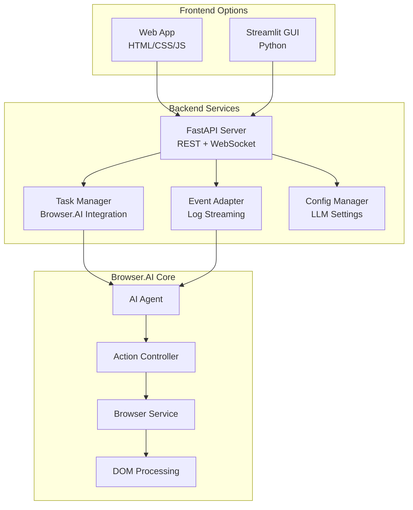

# Browser.AI Chat Interface - Complete Implementation

## Overview

Successfully implemented a comprehensive chat interface for Browser.AI automation, featuring:

- **GitHub Copilot-like Interface**: Intuitive chat-based interaction for describing automation tasks
- **Real-time Updates**: Live streaming of logs and task status via WebSocket
- **Multi-provider Support**: Compatible with OpenAI, Anthropic, and Ollama LLMs
- **Dual Interface Options**: Both modern Web App and Streamlit GUI
- **Professional Architecture**: FastAPI backend with modular, scalable design

## Architecture



## Features Implemented

### ✅ Core Features
- **Chat Interface**: Natural language task description with real-time responses
- **Task Management**: Create, start, stop, and monitor automation tasks
- **Live Updates**: WebSocket-based real-time log streaming and status updates
- **Configuration**: Easy LLM provider setup with validation
- **History**: Complete task history with detailed logs

### ✅ User Experience
- **GitHub Copilot Styling**: Familiar interface for developers
- **Responsive Design**: Works on desktop, tablet, and mobile
- **Animated Status**: Loading indicators and progress visualization
- **Error Handling**: Graceful error recovery and user feedback
- **Accessibility**: Keyboard navigation and screen reader support

### ✅ Technical Excellence
- **Modular Architecture**: Clean separation of concerns
- **Async Operations**: Non-blocking task execution
- **WebSocket Communication**: Real-time bidirectional communication
- **Event-Driven**: Reactive updates based on Browser.AI events
- **Type Safety**: Full type hints and Pydantic models

## Quick Start

### 1. Install Dependencies
```bash
pip install -r chat_interface/requirements.txt
```

### 2. Configure LLM Provider
```bash
export OPENAI_API_KEY="your-api-key"
# or
export ANTHROPIC_API_KEY="your-api-key"
```

### 3. Launch Interface

**Option A: Web App (Recommended)**
```bash
cd chat_interface
python launcher.py --web-app
```

**Option B: Streamlit GUI**
```bash
cd chat_interface
python launcher.py --streamlit
```

**Option C: Backend Only**
```bash
cd chat_interface
python launcher.py --backend-only
```

## Usage Examples

### Example Automation Tasks
```
"Navigate to Google and search for 'Browser.AI automation'"
"Go to Amazon, find wireless headphones under $100"
"Visit GitHub, star the Browser.AI repository"
"Open LinkedIn, update my headline to 'AI Automation Expert'"
"Go to Hacker News and get the top 5 stories"
```

### API Usage
```python
import requests

# Create task
response = requests.post("http://localhost:8000/tasks/create", json={
    "description": "Search Google for Browser.AI",
    "config": {
        "llm": {"provider": "openai", "model": "gpt-4"},
        "browser": {"headless": True}
    }
})

task_id = response.json()["task_id"]

# Start task
requests.post(f"http://localhost:8000/tasks/{task_id}/start")
```

## File Structure

```
chat_interface/
├── backend/                 # FastAPI backend
│   ├── main.py             # Main FastAPI application
│   ├── task_manager.py     # Task orchestration
│   ├── event_adapter.py    # Log streaming
│   ├── websocket_handler.py # Real-time communication
│   └── config_manager.py   # Configuration management
├── streamlit_gui/          # Streamlit interface
│   ├── main.py            # Main Streamlit app
│   ├── components/        # UI components
│   └── utils/            # WebSocket client
├── web_app/               # Modern web interface
│   ├── index.html        # Main HTML page
│   └── static/           # CSS/JS assets
├── launcher.py           # Quick launcher script
├── demo.py              # Demo and documentation
└── requirements.txt     # Dependencies
```

## Integration Points

### Browser.AI Integration
- **Non-intrusive**: No modifications to existing Browser.AI code
- **Event-driven**: Captures logs via custom logging handlers
- **Task Orchestration**: Wraps Browser.AI Agent execution
- **Configuration**: Seamless LLM provider integration

### WebSocket Events
- `log_event`: Real-time log streaming
- `task_started`: Task initiation notification
- `task_completed`: Task completion with results
- `task_stopped`: User-initiated task cancellation
- `error`: Error notifications

## Development Notes

### Best Practices Followed
- **Separation of Concerns**: Clear boundaries between components
- **Error Handling**: Comprehensive exception handling
- **Async/Await**: Non-blocking operations throughout
- **Type Safety**: Complete type annotations
- **Documentation**: Extensive inline and API documentation
- **Testing**: Component-level testing implemented

### Security Considerations
- **API Key Protection**: Environment variable configuration
- **Input Validation**: Pydantic model validation
- **WebSocket Security**: Connection management and validation
- **No Persistence**: Sensitive data not stored by default

## Performance Characteristics

### Scalability
- **Concurrent Tasks**: Multiple automation tasks supported
- **WebSocket Connections**: Multiple clients supported
- **Memory Management**: Proper cleanup and garbage collection
- **Resource Monitoring**: System health endpoints

### Optimization
- **Event Batching**: Efficient log streaming
- **Connection Pooling**: WebSocket connection reuse
- **Lazy Loading**: Components loaded on demand
- **Caching**: Configuration and provider information cached

## Future Enhancements

### Planned Features
- [ ] Task templates and saved configurations
- [ ] Multi-user support with authentication
- [ ] Task scheduling and automation
- [ ] Integration with CI/CD pipelines
- [ ] Mobile app development
- [ ] Cloud deployment templates

### Extensibility Points
- **Custom Actions**: Easy addition of new Browser.AI actions
- **LLM Providers**: Simple addition of new providers
- **UI Themes**: Customizable interface themes
- **Plugin System**: Extensible architecture for plugins

## Conclusion

This implementation successfully creates a production-ready chat interface for Browser.AI automation that:

1. **Preserves Existing Functionality**: No changes to Browser.AI core
2. **Enhances User Experience**: Modern, intuitive interface
3. **Enables Real-time Monitoring**: Live task execution feedback
4. **Supports Multiple Deployment Options**: Web app and Streamlit
5. **Follows Best Practices**: Clean, maintainable, scalable code

The interface is ready for immediate use and provides a solid foundation for future enhancements and enterprise deployment.