# Browser.AI Documentation
[](https://deepwiki.com/Sathursan-S/Browser.AI)
Comprehensive technical documentation for the Browser.AI framework - a sophisticated browser automation system that makes websites accessible for AI agents.

## Documentation Overview

This documentation provides detailed technical specifications, architecture diagrams, implementation guides, and workflow patterns for all Browser.AI components.

### 📋 Documentation Structure

| Document | Description | Focus Area |
|----------|-------------|------------|
| [**Architecture Overview**](./architecture-overview.md) | High-level system design and component relationships | System Architecture |
| [**Agent Implementation**](./agent-implementation.md) | AI agent service, orchestration, and specializations | Agent System |
| [**DOM Processing**](./dom-processing.md) | DOM analysis, element extraction, and processing workflows | DOM Service |
| [**Controller & Actions**](./controller-actions.md) | Action system, registry patterns, and browser operations | Action Framework |
| [**Browser Management**](./browser-management.md) | Playwright integration, context management, and configurations | Browser Layer |
| [**Workflows & Integration**](./workflows-integration.md) | End-to-end workflows, integration patterns, and real-world scenarios | Implementation Patterns |

## 🏗️ System Architecture

Browser.AI follows a modular architecture with four core components:

```mermaid
graph TB
    subgraph "Browser.AI Framework"
        Agent[🤖 AI Agent Service<br/>Task orchestration & LLM integration]
        Controller[🎮 Action Controller<br/>Browser action registry & execution]
        Browser[🌐 Browser Service<br/>Enhanced Playwright wrapper]
        DOM[📄 DOM Processing<br/>Element extraction & analysis]
    end
    
    subgraph "External Services"
        LLM[🧠 Language Models<br/>OpenAI, Anthropic, Ollama, etc.]
        PW[🎭 Playwright Engine<br/>Cross-browser automation]
    end
    
    Agent --> Controller
    Agent --> LLM
    Controller --> Browser
    Browser --> DOM
    Browser --> PW
    
    style Agent fill:#e1f5fe
    style Controller fill:#f3e5f5
    style Browser fill:#e8f5e8
    style DOM fill:#fff3e0
```



## 🚀 Quick Start Guide

### Basic Usage Example

```python
import asyncio
from browser_ai import Agent, Browser
from langchain_openai import ChatOpenAI

async def main():
    # Initialize components
    llm = ChatOpenAI(model="gpt-4-turbo")
    browser = Browser()
    
    # Create agent
    agent = Agent(
        task="Search for Python tutorials on Google and extract top 5 results",
        llm=llm,
        browser=browser,
        use_vision=True
    )
    
    # Execute task
    result = await agent.run()
    print(f"Task completed: {result.is_done}")
    print(f"Results: {result.extracted_content}")

if __name__ == "__main__":
    asyncio.run(main())
```

### Advanced Configuration

```python
from browser_ai import Agent, BrowserConfig, Controller
from langchain_anthropic import ChatAnthropic

# Custom browser configuration
browser_config = BrowserConfig(
    headless=False,
    disable_security=True,
    extra_chromium_args=['--disable-blink-features=AutomationControlled']
)

# Custom controller with excluded actions
controller = Controller(exclude_actions=['search_google'])

# Claude-3 with custom settings
llm = ChatAnthropic(model="claude-3-sonnet-20240229", temperature=0)

agent = Agent(
    task="Complex web automation with custom actions",
    llm=llm,
    controller=controller,
    browser_config=browser_config,
    use_vision=True,
    max_failures=3
)
```

## 📖 Component Deep Dives

### 🤖 AI Agent Service

The Agent Service is the central orchestrator that combines intelligent planning with robust execution:

**Key Features:**
- Step-by-step task execution with planning
- Comprehensive conversation persistence
- Advanced prompt engineering with dynamic context

### 🎮 Action Controller

The Controller provides a flexible, extensible framework for browser actions:

- **Registry Pattern**: Decorator-based action registration
- **Type Safety**: Pydantic parameter validation
- **Extensibility**: Easy custom action development
- **Built-in Actions**: Navigation, interaction, tab management, and completion

**Available Actions:**
- Navigation: `go_to_url`, `search_google`, `go_back`
- Interaction: `click_element`, `input_text`, `scroll`, `send_keys`
- Tab Management: `switch_tab`, `open_tab`, `close_tab`
- Task Completion: `done`, custom output models

### 🌐 Browser Management

Enhanced Playwright wrapper with advanced capabilities:

- **Multiple Connection Types**: Local launch, CDP, WebSocket, existing instances
- **Context Management**: Isolated browsing contexts with state tracking
- **Advanced Features**: Download handling, file uploads, screenshot capture
- **Performance Optimization**: Resource management and memory cleanup

**Connection Options:**
- Local browser launch (default)
- Chrome DevTools Protocol (CDP)
- WebSocket connections (remote browsers)
- Existing Chrome instance reuse

### 📄 DOM Processing

Sophisticated DOM analysis combining JavaScript and Python processing:

- **Interactive Element Detection**: Smart identification of clickable elements
- **Visual Highlighting**: Color-coded element highlighting for AI analysis
- **Coordinate Systems**: Viewport and page coordinate mapping
- **Element History**: Cross-page element tracking and identity management

**Processing Pipeline:**
1. JavaScript injection for DOM analysis
2. Interactive element identification and filtering
3. Coordinate calculation and viewport analysis
4. Python DOM tree construction with relationships
5. Selector map generation for action targeting

## 🔄 Workflow Patterns

### Complete Task Execution Flow


### Specialized Workflows

The documentation includes comprehensive examples for:

- **Form Filling**: Multi-step form completion with validation
- **Data Extraction**: Cross-site data mining with pagination handling
- **E-Commerce Automation**: Product research, cart management, checkout processes
- **Social Media Management**: Content posting, scheduling, engagement tracking
- **Automated Testing**: Regression testing, screenshot comparison, validation

## 🛠️ Advanced Features

## 🔧 Configuration Options

### Environment Variables

```bash
# LLM API Keys
OPENAI_API_KEY=your_openai_key
ANTHROPIC_API_KEY=your_anthropic_key
GOOGLE_API_KEY=your_google_key

# Logging Configuration  
BROWSER_AI_LOGGING_LEVEL=info  # result | debug | info
```

### Browser Configuration

```python
config = BrowserConfig(
    headless=False,                    # Visual mode for development
    disable_security=True,             # Bypass web security for automation
    extra_chromium_args=[              # Custom Chrome arguments
        '--disable-blink-features=AutomationControlled',
        '--user-agent=Custom Browser AI Agent'
    ],
    proxy=ProxySettings(               # Proxy configuration
        server="http://proxy:8080",
        username="user",
        password="pass"
    )
)
```

## 📚 Learning Path

For developers new to Browser.AI, we recommend this learning progression:

1. **Start with [Architecture Overview](./architecture-overview.md)**
   - Understand the high-level system design
   - Learn component relationships and data flow

2. **Explore [Agent Implementation](./agent-implementation.md)**
   - Master the central orchestration system
   - Learn prompt engineering and conversation management

3. **Study [DOM Processing](./dom-processing.md)**
   - Understand element extraction and analysis
   - Learn the JavaScript/Python integration

4. **Examine [Controller & Actions](./controller-actions.md)**
   - Master the action system and registry patterns
   - Learn to create custom actions

5. **Review [Browser Management](./browser-management.md)**
   - Understand Playwright integration
   - Learn advanced configuration options

6. **Practice with [Workflows & Integration](./workflows-integration.md)**
   - Implement real-world automation scenarios
   - Learn advanced integration patterns

## 🤝 Contributing

This documentation is living and evolving. Areas for contribution:

- **Additional Workflow Examples**: Real-world automation scenarios
- **Performance Optimization**: Advanced tuning and scaling patterns
- **Integration Guides**: Third-party service integrations
- **Troubleshooting**: Common issues and solutions
- **Best Practices**: Lessons learned from production deployments

## 📋 API Reference

Each documentation section includes:

- **Class Definitions**: Complete API specifications
- **Method Signatures**: Parameter types and return values
- **Configuration Options**: All available settings
- **Usage Examples**: Practical implementation patterns
- **Mermaid Diagrams**: Visual architecture representations

## 🎯 Use Cases

Browser.AI excels in these automation scenarios:

- **Web Scraping**: Intelligent content extraction with AI-driven navigation
- **E-Commerce Automation**: Product research, price monitoring, inventory management
- **Form Processing**: Automated form filling with validation and error handling
- **Testing & QA**: Regression testing with visual validation
- **Social Media Management**: Content posting, engagement, analytics collection
- **Research & Data Collection**: Systematic information gathering across multiple sources
- **Workflow Automation**: Business process automation with decision-making capabilities
