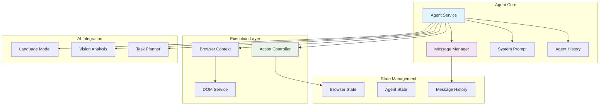
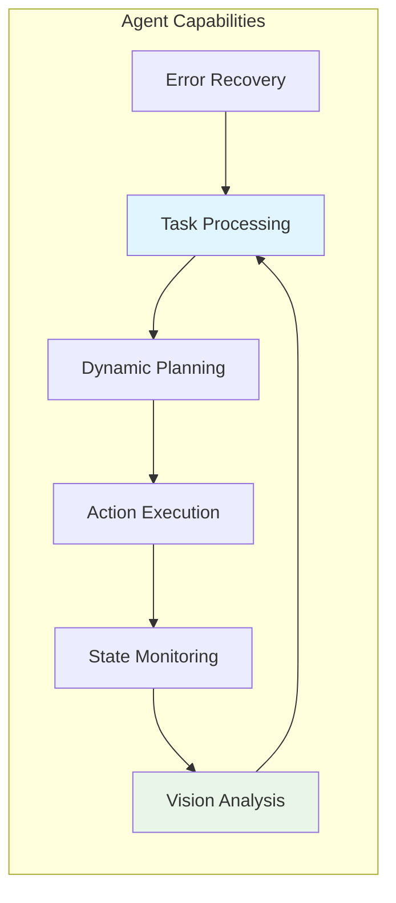
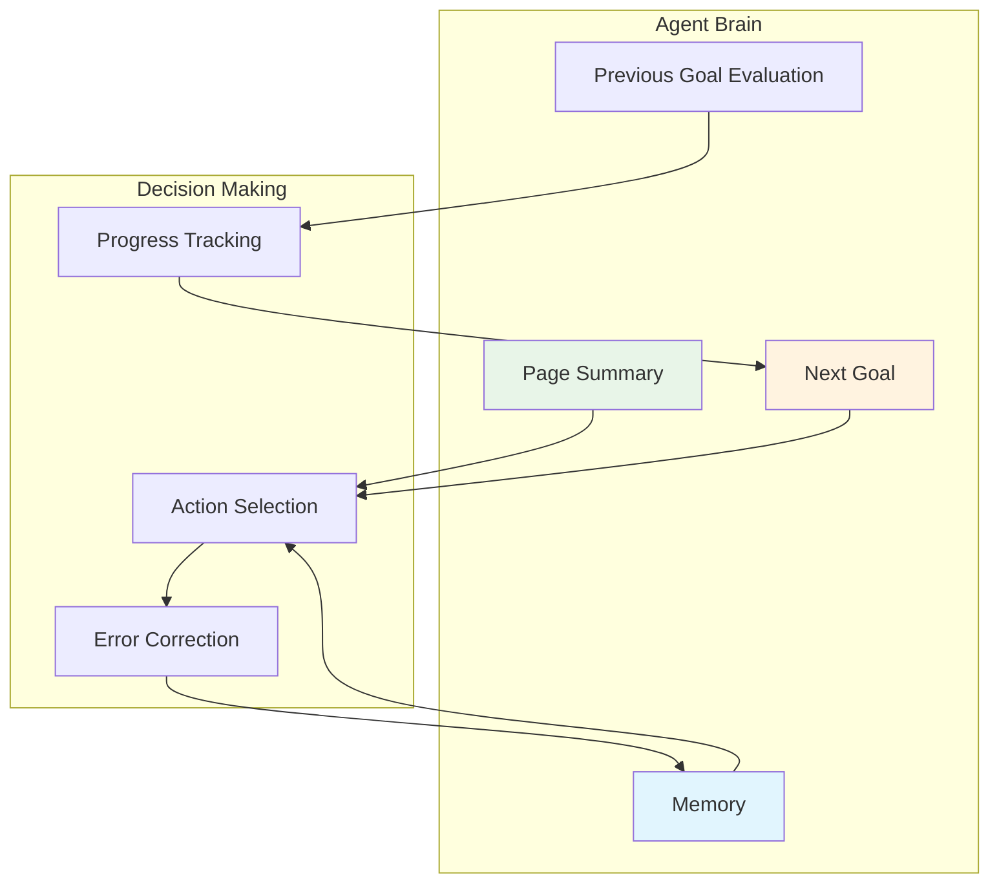
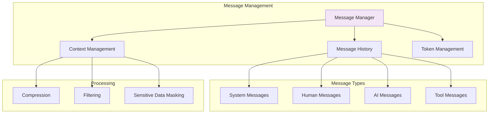
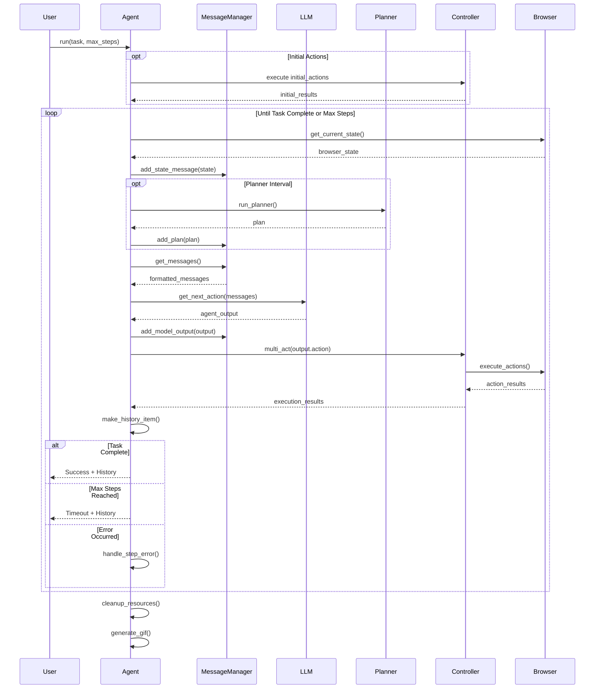
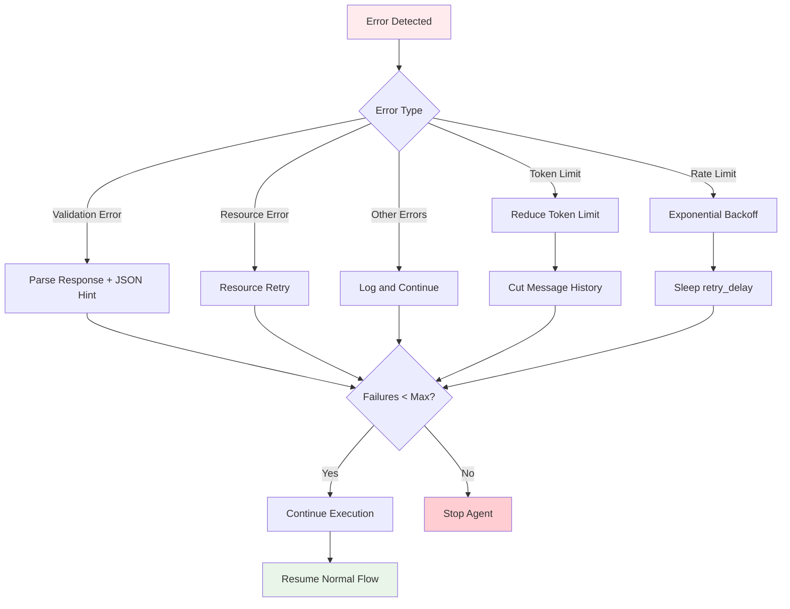
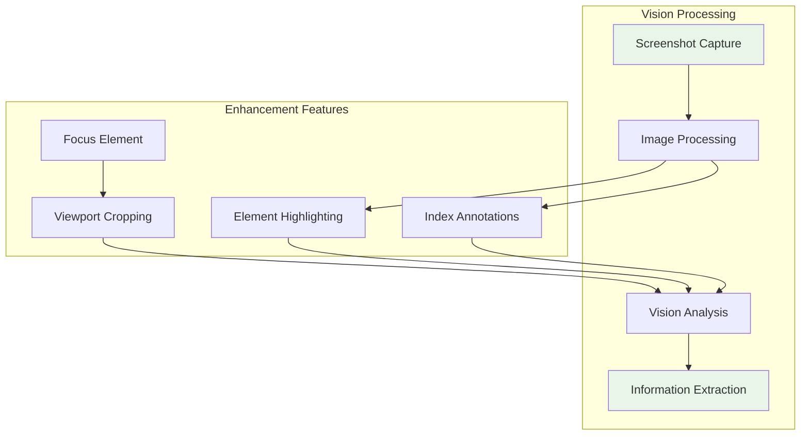

# Agent Implementation and Orchestration

## Overview

The Browser.AI Agent Service is the central orchestrator that coordinates all browser automation tasks using AI decision-making. It provides a single, powerful agent implementation that combines intelligent planning with robust execution through a sophisticated architecture managing conversation state, action execution, and error recovery.

## Agent Architecture

### Core Agent Structure



### Agent Initialization Parameters

The Agent class supports extensive configuration through initialization parameters:

```python
class Agent:
    def __init__(
        self,
        task: str,                                    # Primary task description
        llm: BaseChatModel,                          # Main language model
        browser: Browser | None = None,               # Optional browser instance
        browser_context: BrowserContext | None = None, # Optional browser context
        controller: Controller = Controller(),        # Action controller
        use_vision: bool = True,                     # Enable vision capabilities
        use_vision_for_planner: bool = False,        # Use vision in planning
        save_conversation_path: Optional[str] = None, # Conversation persistence
        save_conversation_path_encoding: Optional[str] = 'utf-8',
        max_failures: int = 3,                       # Maximum consecutive failures
        retry_delay: int = 10,                       # Retry delay in seconds
        system_prompt_class: Type[SystemPrompt] = SystemPrompt,
        max_input_tokens: int = 128000,              # Token limit management
        validate_output: bool = False,               # Output validation
        message_context: Optional[str] = None,       # Additional context
        generate_gif: bool | str = True,             # Animation generation
        sensitive_data: Optional[Dict[str, str]] = None, # Data masking
        available_file_paths: Optional[list[str]] = None, # Available files for processing
        include_attributes: list[str] = [            # DOM element attributes to include
            'title', 'type', 'name', 'role', 'tabindex', 
            'aria-label', 'placeholder', 'value', 'alt', 'aria-expanded'
        ],
        max_error_length: int = 400,                 # Maximum error message length
        max_actions_per_step: int = 10,              # Maximum actions per step
        tool_call_in_content: bool = True,           # Include tool calls in content
        initial_actions: Optional[List[Dict[str, Dict[str, Any]]]] = None, # Initial actions
        # Cloud Callbacks
        register_new_step_callback: Callable = None, # Callback for new steps
        register_done_callback: Callable = None,     # Callback for completion
        tool_calling_method: Optional[str] = 'auto', # Tool calling method
        page_extraction_llm: Optional[BaseChatModel] = None, # Dedicated extraction LLM
        planner_llm: Optional[BaseChatModel] = None, # Dedicated planning LLM
        planner_interval: int = 1,                   # Planning frequency
    )
```

## The Agent Implementation

### Core Agent Capabilities

The single Agent class in `browser_ai/agent/service.py` provides comprehensive browser automation capabilities:



**Key Features:**
- **Multi-LLM Support**: Compatible with OpenAI, Anthropic, Google, Ollama, and other LangChain models
- **Vision Integration**: Screenshot analysis for intelligent decision making
- **Dynamic Planning**: Optional dedicated planner LLM for complex workflows
- **Conversation Persistence**: Save and resume conversations across sessions
- **Robust Error Recovery**: Automatic retry mechanisms with exponential backoff
- **Multi-Action Sequencing**: Execute multiple actions in a single step
- **State Management**: Comprehensive browser and agent state tracking

## Agent Data Models and State Management

### Core Data Structures

The agent uses several key data models defined in `browser_ai/agent/views.py`:

```python
@dataclass
class AgentStepInfo:
    """Information about the current step in agent execution"""
    step_number: int
    max_steps: int

class ActionResult(BaseModel):
    """Result of executing an action"""
    is_done: Optional[bool] = False
    extracted_content: Optional[str] = None
    error: Optional[str] = None
    include_in_memory: bool = False

class AgentBrain(BaseModel):
    """Current cognitive state of the agent"""
    page_summary: str
    evaluation_previous_goal: str
    memory: str
    next_goal: str

class AgentOutput(BaseModel):
    """Complete output from the agent's reasoning"""
    current_state: AgentBrain
    action: list[ActionModel]

class AgentHistory(BaseModel):
    """Single step in agent execution history"""
    model_output: AgentOutput | None
    result: list[ActionResult]
    state: BrowserStateHistory

class AgentHistoryList(BaseModel):
    """Complete agent execution history with utility methods"""
    history: list[AgentHistory]
```

### Agent Brain Architecture

The agent maintains a sophisticated cognitive model through the `AgentBrain` class:



## Message Management System

### Message Manager Architecture

The Message Manager (`browser_ai/agent/message_manager/service.py`) handles conversation state and context management:



### Message Flow and Processing

```python
class MessageManager:
    """Manages conversation history and context for the agent"""
    
    def __init__(
        self,
        llm: BaseChatModel,
        task: str,
        action_descriptions: str,
        system_prompt_class: Type[SystemPrompt],
        max_input_tokens: int = 128000,
        estimated_characters_per_token: int = 3,
        image_tokens: int = 800,
        include_attributes: list[str] = [],
        max_error_length: int = 400,
        max_actions_per_step: int = 10,
        message_context: Optional[str] = None,
        sensitive_data: Optional[Dict[str, str]] = None,
    )
```

**Key Responsibilities:**
- Conversation history management with message metadata
- Token limit enforcement and context truncation
- Dynamic system prompt generation
- Sensitive data masking and filtering
- Message formatting for different LLM providers
- State-aware context management

## System Prompt Engineering

### Prompt Architecture

The system prompt is managed by the `SystemPrompt` class in `browser_ai/agent/prompts.py`:

```mermaid
graph TB
    subgraph "System Prompt Structure"
        Rules[Important Rules]
        Format[Response Format]
        Actions[Action Descriptions]
        Input[Input Format]
        Examples[Usage Examples]
    end
    
    subgraph "Dynamic Elements"
        State[Current State]
        Elements[Available Elements]
        Progress[Step Progress]
        Results[Action Results]
    end
    
    Rules --> Format
    Format --> Actions
    Actions --> Input
    Input --> Examples
    State --> Elements
    Elements --> Progress
    Progress --> Results
    
    style Rules fill:#fff3e0
    style Format fill:#e8f5e8
```



### Core Prompt Components

The SystemPrompt class provides structured prompt generation:

```python
class SystemPrompt:
    def __init__(self, action_description: str, max_actions_per_step: int = 10):
        self.default_action_description = action_description
        self.max_actions_per_step = max_actions_per_step
    
    def important_rules(self) -> str:
        """Returns comprehensive rules for agent behavior including:
        - JSON response format requirements
        - Multi-action sequencing guidelines
        - Element interaction patterns
        - Error handling and recovery strategies
        - Task completion criteria
        - Visual context interpretation
        """
        
    def input_format(self) -> str:
        """Defines the structure of input elements and interaction indexes"""
        
    def get_system_message(self) -> SystemMessage:
        """Generates complete system message for current context"""
```

### Agent Response Format

The agent must respond with a specific JSON structure:

```json
{
  "current_state": {
    "page_summary": "Summary of new information from current page",
    "evaluation_previous_goal": "Success|Failed|Unknown - Analysis of previous goal",
    "memory": "Specific memory of what has been done and what remains",
    "next_goal": "What needs to be done with the next actions"
  },
  "action": [
    {
      "action_name": {
        "parameter1": "value1",
        "parameter2": "value2"
      }
    }
  ]
}
```

## Agent Execution Flow

### Step-by-Step Processing



### Core Execution Methods

#### Main Run Method

```python
async def run(self, max_steps: int = 100) -> AgentHistoryList:
    """Execute the task with maximum number of steps
    
    Features:
    - Initial action execution
    - Step-by-step task processing
    - Automatic resource cleanup
    - GIF generation for task visualization
    - Comprehensive error handling
    """
```

#### Step Execution

```python
async def step(self, step_info: Optional[AgentStepInfo] = None) -> None:
    """Execute one step of the task
    
    Process:
    1. Get current browser state
    2. Add state to message history
    3. Run planner if configured
    4. Generate LLM response
    5. Execute actions via controller
    6. Handle results and errors
    7. Update history
    """
```

### Error Handling and Recovery



**Error Handling Features:**
- **Validation Errors**: JSON parsing issues with helpful hints
- **Token Limit Management**: Automatic context reduction
- **Rate Limit Handling**: Exponential backoff with configurable delays
- **Resource Exhaustion**: Retry with backoff for cloud API limits
- **Consecutive Failure Tracking**: Stop after max_failures attempts
- **Error Contextualization**: Include stack traces in debug mode

## Vision Integration

### Screenshot Analysis Pipeline



### Vision-Enabled Decision Making

The agent can leverage vision capabilities in multiple ways:

1. **Element Recognition**: Identify interactive elements through visual analysis
2. **State Verification**: Confirm action results through visual inspection
3. **Content Understanding**: Extract information from complex visual layouts
4. **Error Detection**: Identify UI errors or unexpected states

## Advanced Features

### Dynamic Planning System

The agent supports an optional dedicated planner LLM for enhanced strategic thinking:

```python
# Configure separate LLM for planning
planner_llm = ChatOpenAI(model="gpt-4", temperature=0)

agent = Agent(
    task="Complete multi-step workflow",
    llm=main_llm,
    planner_llm=planner_llm,
    planner_interval=3,  # Re-plan every 3 steps
    use_vision_for_planner=True,  # Include screenshots in planning
)
```

**Planning Features:**
- **Interval-based Planning**: Run planner every N steps for strategy updates
- **Vision-aware Planning**: Include or exclude screenshots for planner context
- **Full History Access**: Planner sees complete conversation history
- **JSON/Text Output**: Flexible planning output formats
- **Model-specific Handling**: Special processing for models like DeepSeek Reasoner

### Conversation Persistence

```python
agent = Agent(
    task="Data extraction task",
    llm=llm,
    save_conversation_path="./conversations/",
    save_conversation_path_encoding="utf-8"
)
```

### Sensitive Data Masking

```python
agent = Agent(
    task="Login and extract data",
    llm=llm,
    sensitive_data={
        "password": "***MASKED***",
        "email": "***EMAIL***",
        "api_key": "***REDACTED***"
    }
)
```

### Multi-Action Sequencing

Execute multiple actions in a single step:

```python
# Agent can execute action sequences like:
[
    {"input_text": {"index": 1, "text": "username"}},
    {"input_text": {"index": 2, "text": "password"}},
    {"click_element": {"index": 3}}
]
```

### Vision Integration

The agent leverages vision capabilities for:

1. **Screenshot Analysis**: Understanding page layout and visual context
2. **Element Identification**: Visual element recognition with bounding boxes
3. **State Verification**: Confirming action results through visual inspection
4. **Error Detection**: Identifying visual indicators of errors or unexpected states

### Control Flow Management

The agent supports runtime control:

```python
# Pause/resume functionality
agent.pause()
agent.resume()
agent.stop()

# Check agent state
is_paused = agent._paused
is_stopped = agent._stopped
```

## Performance Optimization

### Token Management Strategy

The agent implements sophisticated token management:

- **Adaptive Context**: Automatically adjusts context length based on token limits
- **Dynamic Truncation**: Reduces max_input_tokens on limit exceeded
- **History Compression**: Intelligently cuts message history when needed
- **Image Token Accounting**: Accounts for vision tokens (default: 800 per image)
- **Selective Memory**: Retains only relevant state information in conversation

### Execution Efficiency Features

- **Multi-Action Batching**: Execute action sequences in single steps
- **Smart Retry Logic**: Exponential backoff for transient failures
- **Resource Management**: Automatic browser context and resource cleanup
- **Step Control**: Pause/resume/stop functionality for long-running tasks
- **Failure Thresholds**: Configurable max consecutive failures

### Observability and Monitoring

```python
from lmnr import observe

# Automatic tracing with LMNR
@observe(name="agent_execution")
async def run_agent_task():
    result = await agent.run()
    return result

# Custom callbacks
agent = Agent(
    task=task,
    llm=llm,
    register_new_step_callback=lambda state, output, step: log_step(state, output, step),
    register_done_callback=lambda history: save_results(history)
)
```

**Monitoring Features:**
- **Automatic Tracing**: Built-in LMNR observability integration
- **Step Callbacks**: Custom callbacks for each agent step
- **Completion Callbacks**: Callbacks when tasks complete
- **GIF Generation**: Visual task execution recordings
- **Comprehensive Logging**: Detailed logging at multiple levels

## Best Practices

### 1. Task Definition

```python
# Good: Specific, actionable task with clear success criteria
task = "Navigate to GitHub, search for 'browser-ai', and extract the first 3 repository names, descriptions, and star counts"

# Avoid: Vague, open-ended task
task = "Help me find some code repositories"
```

### 2. LLM Selection and Configuration

```python
# For complex reasoning and vision tasks: GPT-4 or Claude
llm = ChatOpenAI(model="gpt-4-turbo", temperature=0)

# For simple navigation tasks: GPT-3.5
llm = ChatOpenAI(model="gpt-3.5-turbo", temperature=0)

# For local deployment: Ollama
llm = ChatOllama(model="llama3.1:8b", temperature=0)

# For specialized planning: Dedicated planner LLM
planner_llm = ChatOpenAI(model="gpt-4", temperature=0.1)
```

### 3. Error Handling Configuration

```python
agent = Agent(
    task=task,
    llm=llm,
    max_failures=5,          # Allow more retries for complex tasks
    retry_delay=15,          # Longer delay for rate-limited APIs
    validate_output=True,    # Enable output validation
    max_error_length=800,    # Longer error messages for debugging
)
```

### 4. Memory and Context Management

```python
agent = Agent(
    task=task,
    llm=llm,
    max_input_tokens=100000,     # Adjust based on model limits
    include_attributes=[         # Optimize DOM attribute selection
        'title', 'type', 'name', 'aria-label', 'placeholder', 'value'
    ],
    max_actions_per_step=5,      # Limit action sequences
)
```

## Integration Examples

### Basic Usage

```python
import asyncio
from browser_ai import Agent, Browser
from langchain_openai import ChatOpenAI

async def main():
    # Initialize LLM
    llm = ChatOpenAI(model="gpt-4-turbo", temperature=0)
    
    # Create agent with browser
    agent = Agent(
        task="Search for Python tutorials on Google and extract the first 5 results",
        llm=llm,
        use_vision=True,
        max_failures=3
    )
    
    # Execute task
    result = await agent.run(max_steps=50)
    
    # Check results
    print(f"Task completed: {result.is_done()}")
    print(f"Final result: {result.final_result()}")
    print(f"URLs visited: {result.urls()}")

if __name__ == "__main__":
    asyncio.run(main())
```

### Advanced Configuration with Custom Browser

```python
from browser_ai import Agent, Browser, BrowserConfig, Controller
from langchain_anthropic import ChatAnthropic

async def advanced_agent_example():
    # Custom browser configuration
    browser_config = BrowserConfig(
        headless=False,
        disable_security=True,
        extra_chromium_args=['--disable-blink-features=AutomationControlled']
    )
    browser = Browser(config=browser_config)
    
    # Custom controller with specific actions
    controller = Controller(exclude_actions=['search_google'])
    
    # Anthropic Claude for main reasoning
    main_llm = ChatAnthropic(model="claude-3-sonnet-20240229", temperature=0)
    
    # OpenAI GPT-4 for planning
    planner_llm = ChatOpenAI(model="gpt-4", temperature=0.1)
    
    agent = Agent(
        task="Navigate to e-commerce site, find specific products, and compare prices",
        llm=main_llm,
        browser=browser,
        controller=controller,
        planner_llm=planner_llm,
        planner_interval=2,
        use_vision=True,
        use_vision_for_planner=False,  # Exclude screenshots from planning
        max_failures=3,
        save_conversation_path="./logs/ecommerce_task/",
        sensitive_data={"credit_card": "***MASKED***", "ssn": "***REDACTED***"},
        generate_gif="task_execution.gif",
        initial_actions=[
            {"go_to_url": {"url": "https://example-shop.com"}},
            {"wait": {"seconds": 2}}
        ]
    )
    
    history = await agent.run(max_steps=100)
    
    # Analyze results
    print(f"Actions performed: {len(history.history)}")
    print(f"Errors encountered: {history.errors()}")
    print(f"Extracted content: {history.extracted_content()}")
    
    return history

# Run the example
result = asyncio.run(advanced_agent_example())
```

### Form Automation Example

```python
async def form_automation_example():
    llm = ChatOpenAI(model="gpt-4-turbo")
    
    agent = Agent(
        task="Fill out the contact form with: Name='John Smith', Email='john@example.com', Message='Interested in your services'",
        llm=llm,
        use_vision=True,
        max_actions_per_step=3,  # Allow form filling in sequences
        include_attributes=[      # Include form-relevant attributes
            'name', 'type', 'placeholder', 'aria-label', 'value', 'required'
        ]
    )
    
    result = await agent.run()
    return result
```

### Data Extraction with Planning

```python
async def data_extraction_with_planning():
    main_llm = ChatOpenAI(model="gpt-4-turbo", temperature=0)
    planner_llm = ChatOpenAI(model="gpt-4", temperature=0.1)
    
    agent = Agent(
        task="Extract company information from the top 10 search results for 'AI startups 2024'",
        llm=main_llm,
        planner_llm=planner_llm,
        planner_interval=3,
        use_vision=True,
        max_failures=5,
        save_conversation_path="./extraction_logs/",
        page_extraction_llm=ChatOpenAI(model="gpt-3.5-turbo"),  # Cheaper model for extraction
    )
    
    history = await agent.run(max_steps=200)
    
    # Process extracted data
    extracted_data = []
    for content in history.extracted_content():
        if content:
            extracted_data.append(content)
    
    return extracted_data
```

### Error Recovery and Validation

```python
async def robust_agent_example():
    def step_callback(state, output, step_num):
        print(f"Step {step_num}: Performed {len(output.action)} actions")
        
    def completion_callback(history):
        print(f"Task completed with {len(history.history)} steps")
        if history.has_errors():
            print("Errors encountered during execution")
    
    agent = Agent(
        task="Research competitor prices and create comparison report",
        llm=ChatOpenAI(model="gpt-4-turbo"),
        max_failures=5,
        retry_delay=20,
        validate_output=True,
        register_new_step_callback=step_callback,
        register_done_callback=completion_callback,
        sensitive_data={
            "api_key": "***HIDDEN***",
            "username": "***USER***"
        }
    )
    
    try:
        result = await agent.run(max_steps=150)
        if result.is_done():
            return result.final_result()
        else:
            return f"Partial completion: {len(result.history)} steps executed"
    except Exception as e:
        return f"Agent failed: {str(e)}"
```

---

*This documentation provides comprehensive coverage of the actual Agent implementation in `browser_ai/agent/`. For specific implementation details and the latest features, refer to the source code and docstrings in the agent service module.*