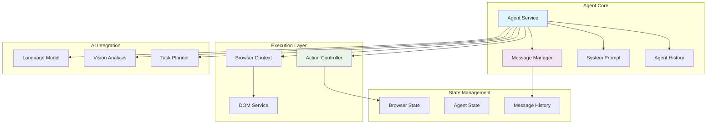
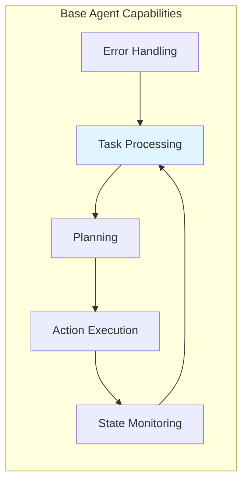
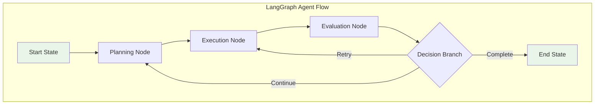
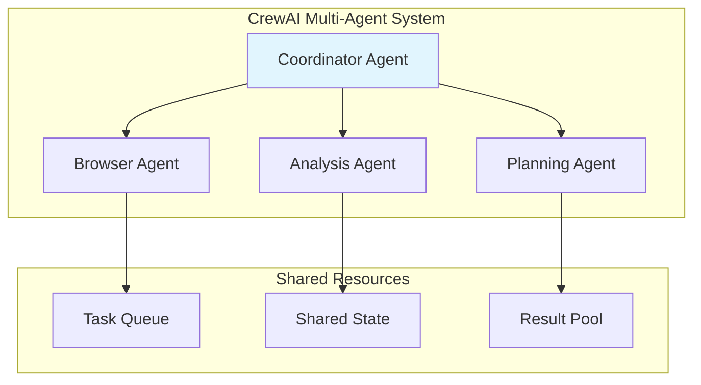
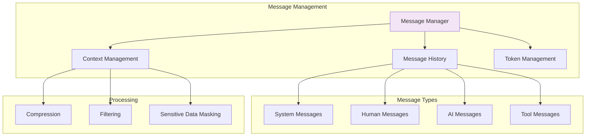
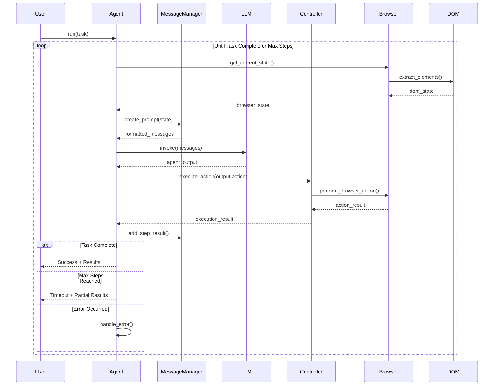
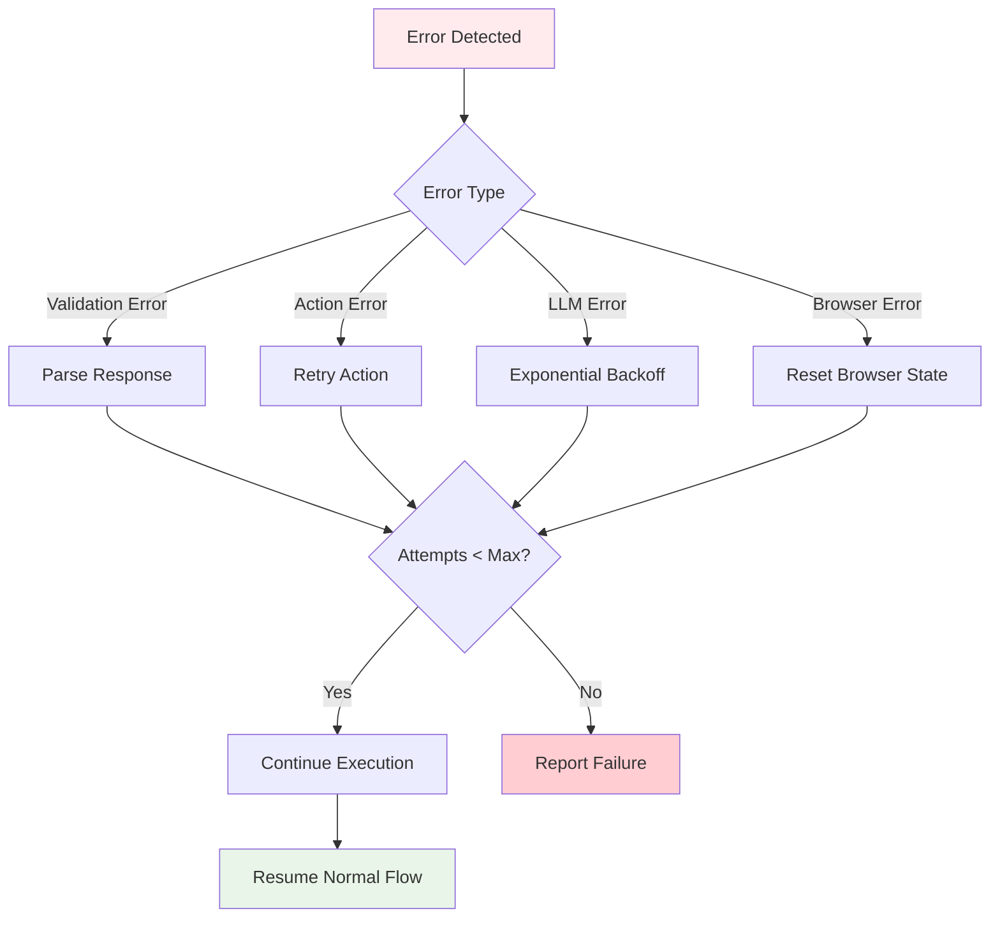
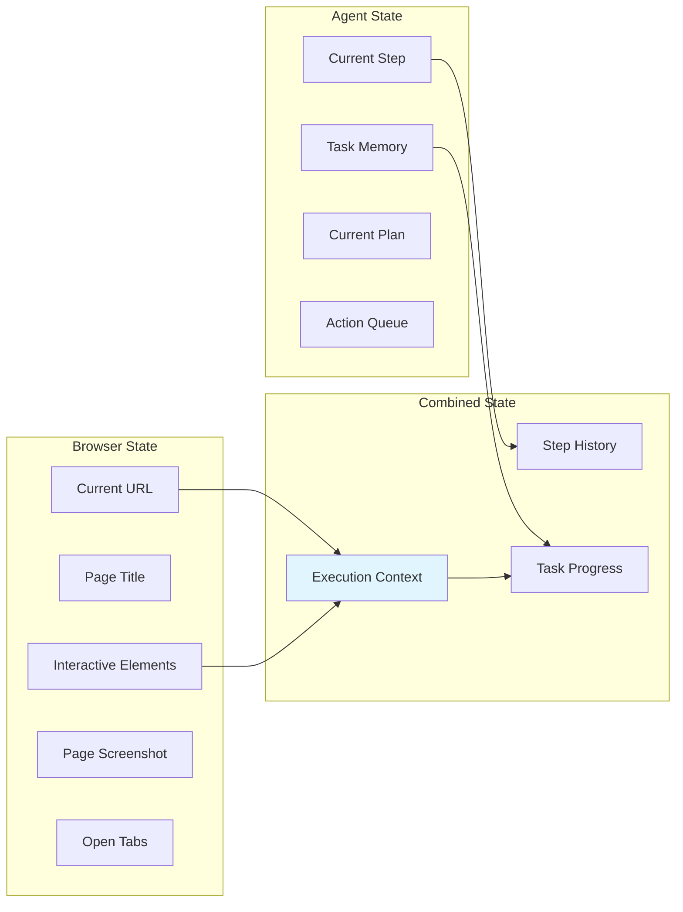
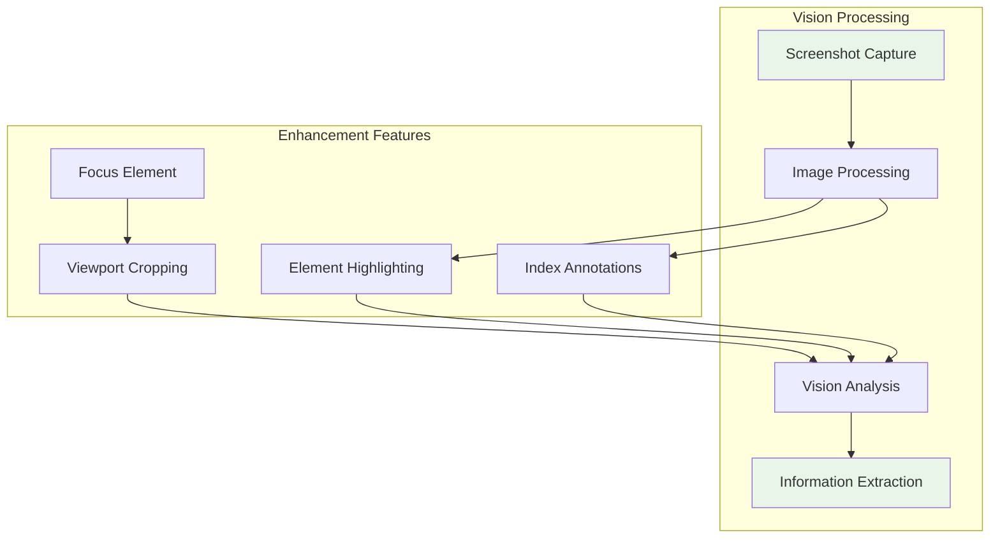

# Agent Implementation and Orchestration

## Overview

The Browser.AI Agent Service is the central orchestrator that coordinates all browser automation tasks using AI decision-making. It combines intelligent planning with robust execution through a sophisticated architecture that manages conversation state, action execution, and error recovery.

## Agent Architecture

### Core Agent Structure



### Agent Initialization Parameters

The Agent class supports extensive configuration through initialization parameters:

```python
class Agent:
    def __init__(
        self,
        task: str,                                    # Primary task description
        llm: BaseChatModel,                          # Main language model
        browser: Browser | None = None,               # Optional browser instance
        browser_context: BrowserContext | None = None, # Optional browser context
        controller: Controller = Controller(),        # Action controller
        use_vision: bool = True,                     # Enable vision capabilities
        use_vision_for_planner: bool = False,        # Use vision in planning
        save_conversation_path: Optional[str] = None, # Conversation persistence
        max_failures: int = 3,                       # Maximum consecutive failures
        retry_delay: int = 10,                       # Retry delay in seconds
        system_prompt_class: Type[SystemPrompt] = SystemPrompt,
        max_input_tokens: int = 128000,              # Token limit management
        validate_output: bool = False,               # Output validation
        message_context: Optional[str] = None,       # Additional context
        generate_gif: bool | str = True,             # Animation generation
        sensitive_data: Optional[Dict[str, str]] = None, # Data masking
        planner_llm: Optional[BaseChatModel] = None, # Dedicated planning LLM
        planner_interval: int = 1,                   # Planning frequency
    )
```

## Agent Types and Specializations

### 1. Base Agent

The core Agent class provides fundamental browser automation capabilities:



**Key Features:**
- Single-task execution
- Step-by-step reasoning
- Vision-enabled decision making
- Automatic error recovery
- Conversation persistence

### 2. LangGraph Reactive Agent

Advanced agent implementation using LangGraph for complex workflow orchestration:



### 3. CrewAI Reactive Agent

Multi-agent collaboration system for complex task delegation:



## Message Management System

### Message Manager Architecture



### Message Flow and Processing

```python
class MessageManager:
    """Manages conversation history and context for the agent"""
    
    def __init__(
        self,
        llm: BaseChatModel,
        task: str,
        action_descriptions: str,
        system_prompt_class: Type[SystemPrompt],
        max_input_tokens: int = 128000,
        estimated_characters_per_token: int = 3,
        image_tokens: int = 800,
        include_attributes: list[str] = [],
        max_error_length: int = 400,
        max_actions_per_step: int = 10,
        message_context: Optional[str] = None,
        sensitive_data: Optional[Dict[str, str]] = None,
    )
```

**Key Responsibilities:**
- Conversation history management
- Token limit enforcement
- Context compression
- Sensitive data masking
- Message formatting for different LLM providers

## System Prompt Engineering

### Prompt Architecture

```mermaid
graph TB
    subgraph "System Prompt Structure"
        Rules[Important Rules]
        Format[Response Format]
        Actions[Action Descriptions]
        Context[Task Context]
        Examples[Usage Examples]
    end
    
    subgraph "Dynamic Elements"
        State[Current State]
        History[Task History]
        Elements[Available Elements]
        Attributes[Element Attributes]
    end
    
    Rules --> Format
    Format --> Actions
    Actions --> Context
    Context --> Examples
    State --> History
    History --> Elements
    Elements --> Attributes
    
    style Rules fill:#fff3e0
```



### Core Prompt Components

```python
class SystemPrompt:
    """Manages system prompt generation for the agent"""
    
    def important_rules(self) -> str:
        """Returns the important rules for the agent"""
        
    def response_format_rules(self) -> str:
        """Defines the expected JSON response format"""
        
    def action_rules(self) -> str:
        """Explains available actions and usage patterns"""
        
    def generate_system_message(
        self,
        action_description: str,
        current_state: BrowserState,
        step_info: AgentStepInfo,
    ) -> SystemMessage:
        """Generates complete system message for current context"""
```

## Agent Execution Flow

### Step-by-Step Processing



### Error Handling and Recovery



## State Management

### Agent State Components

```python
@dataclass
class AgentStepInfo:
    step_number: int
    max_steps: int

class ActionResult(BaseModel):
    """Result of executing an action"""
    is_done: bool = False
    extracted_content: Optional[str] = None
    error: Optional[str] = None
    include_in_memory: bool = True

class AgentHistory(BaseModel):
    """Single step in agent execution history"""
    model_output: AgentOutput
    result: ActionResult
    state: BrowserState
    step_info: AgentStepInfo
    timestamp: datetime

class AgentHistoryList(BaseModel):
    """Complete agent execution history"""
    history: List[AgentHistory]
```

### Browser State Integration



## Vision Integration

### Screenshot Analysis Pipeline



### Vision-Enabled Decision Making

The agent can leverage vision capabilities in multiple ways:

1. **Element Recognition**: Identify interactive elements through visual analysis
2. **State Verification**: Confirm action results through visual inspection
3. **Content Understanding**: Extract information from complex visual layouts
4. **Error Detection**: Identify UI errors or unexpected states

## Advanced Features

### Task Planning with Dedicated LLM

```python
# Configure separate LLM for planning
planner_llm = ChatOpenAI(model="gpt-4", temperature=0)

agent = Agent(
    task="Complete multi-step workflow",
    llm=main_llm,
    planner_llm=planner_llm,
    planner_interval=3,  # Re-plan every 3 steps
)
```

### Conversation Persistence

```python
agent = Agent(
    task="Data extraction task",
    llm=llm,
    save_conversation_path="./conversations/",
    save_conversation_path_encoding="utf-8"
)
```

### Sensitive Data Handling

```python
agent = Agent(
    task="Login and extract data",
    llm=llm,
    sensitive_data={
        "password": "***MASKED***",
        "email": "***EMAIL***"
    }
)
```

## Performance Optimization

### Token Management

- **Adaptive Context**: Automatically adjusts context length based on token limits
- **History Compression**: Compresses older conversation history
- **Selective Memory**: Retains only relevant state information

### Execution Efficiency

- **Batch Actions**: Execute multiple actions in sequence
- **Smart Retry**: Exponential backoff for transient failures
- **Resource Cleanup**: Automatic browser resource management

### Monitoring and Observability

```python
from lmnr import observe

@observe(name="agent_execution")
async def run_agent_task():
    # Agent execution with automatic monitoring
    result = await agent.run()
    return result
```

## Best Practices

### 1. Task Definition

```python
# Good: Specific, actionable task
task = "Navigate to GitHub, search for 'browser-ai', and extract the first 3 repository names"

# Avoid: Vague, open-ended task
task = "Help me find some code repositories"
```

### 2. LLM Selection

```python
# For complex reasoning: GPT-4 or Claude
llm = ChatOpenAI(model="gpt-4-turbo", temperature=0)

# For simple tasks: GPT-3.5
llm = ChatOpenAI(model="gpt-3.5-turbo", temperature=0)

# For local deployment: Ollama
llm = ChatOllama(model="llama2", temperature=0)
```

### 3. Error Handling Configuration

```python
agent = Agent(
    task=task,
    llm=llm,
    max_failures=5,          # Allow more retries for complex tasks
    retry_delay=15,          # Longer delay for rate-limited APIs
    validate_output=True,    # Enable output validation
)
```

## Integration Examples

### Basic Usage

```python
import asyncio
from browser_ai import Agent, Browser
from langchain_openai import ChatOpenAI

async def main():
    llm = ChatOpenAI(model="gpt-4-turbo")
    browser = Browser()
    
    agent = Agent(
        task="Search for Python tutorials on Google",
        llm=llm,
        browser=browser,
        use_vision=True
    )
    
    result = await agent.run()
    print(f"Task completed: {result.is_done}")
    print(f"Extracted content: {result.extracted_content}")

if __name__ == "__main__":
    asyncio.run(main())
```

### Advanced Configuration

```python
from browser_ai import Agent, BrowserConfig, Controller
from langchain_anthropic import ChatAnthropic

# Custom browser configuration
browser_config = BrowserConfig(
    headless=False,
    disable_security=True,
    extra_chromium_args=['--disable-blink-features=AutomationControlled']
)

# Custom controller with excluded actions
controller = Controller(exclude_actions=['search_google'])

# Anthropic Claude with custom settings
llm = ChatAnthropic(model="claude-3-sonnet-20240229", temperature=0)

agent = Agent(
    task="Complex web scraping with form submission",
    llm=llm,
    controller=controller,
    use_vision=True,
    max_failures=3,
    save_conversation_path="./logs/",
    sensitive_data={"api_key": "***MASKED***"}
)
```

---

*This documentation provides comprehensive coverage of the Agent implementation and orchestration system. For specific implementation details, refer to the source code in `browser_ai/agent/`.*