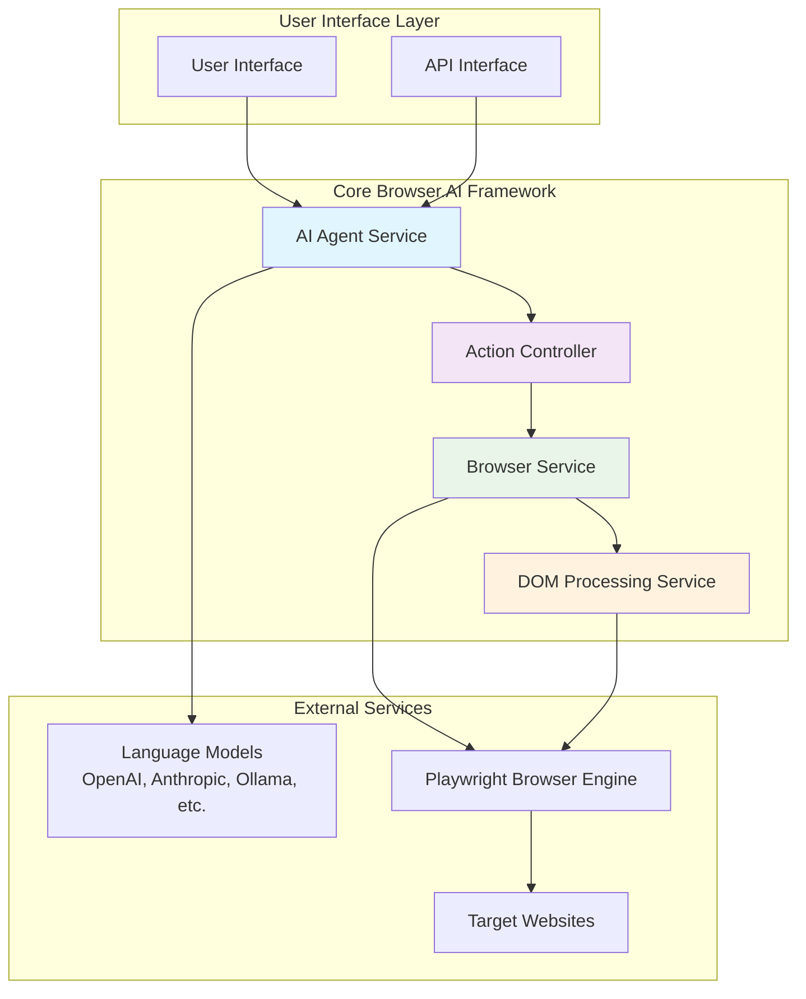
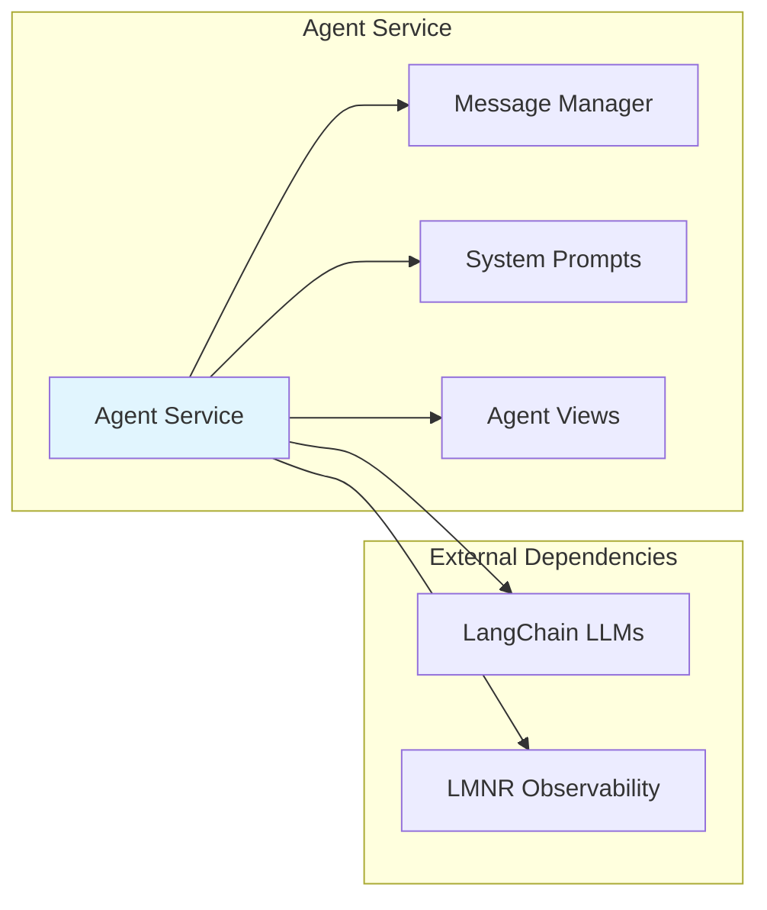
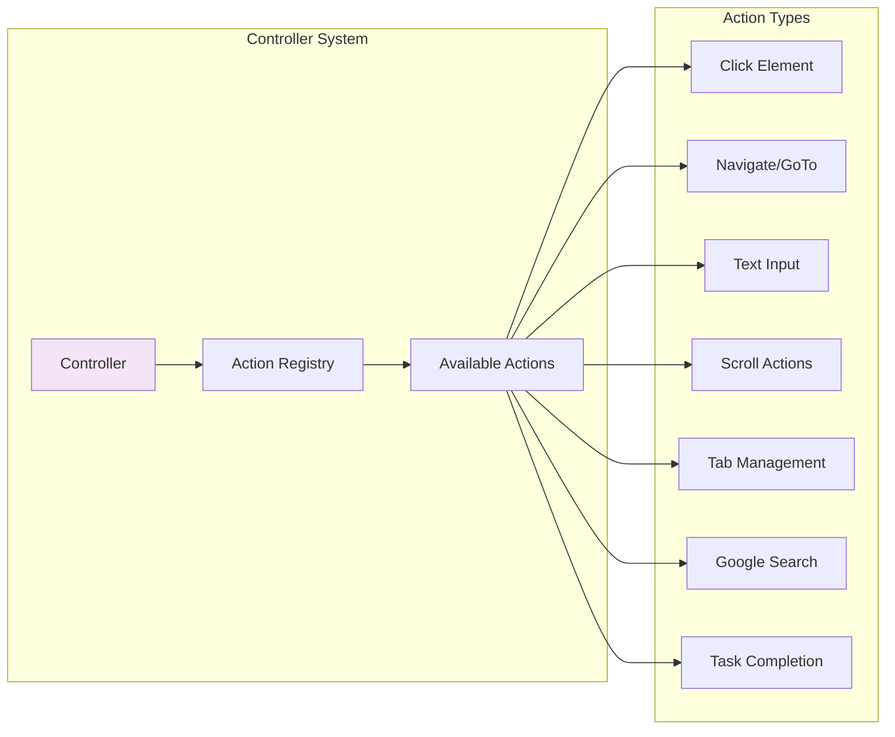
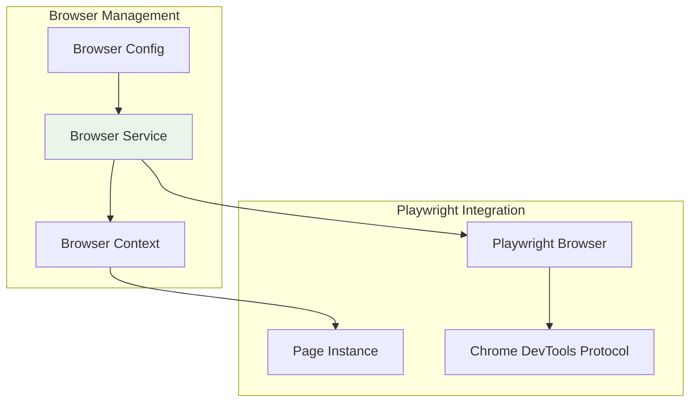
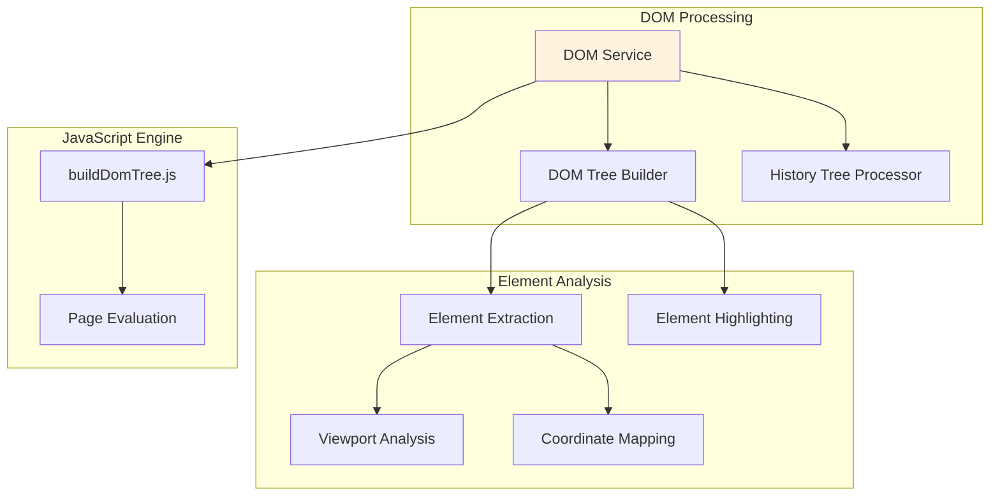
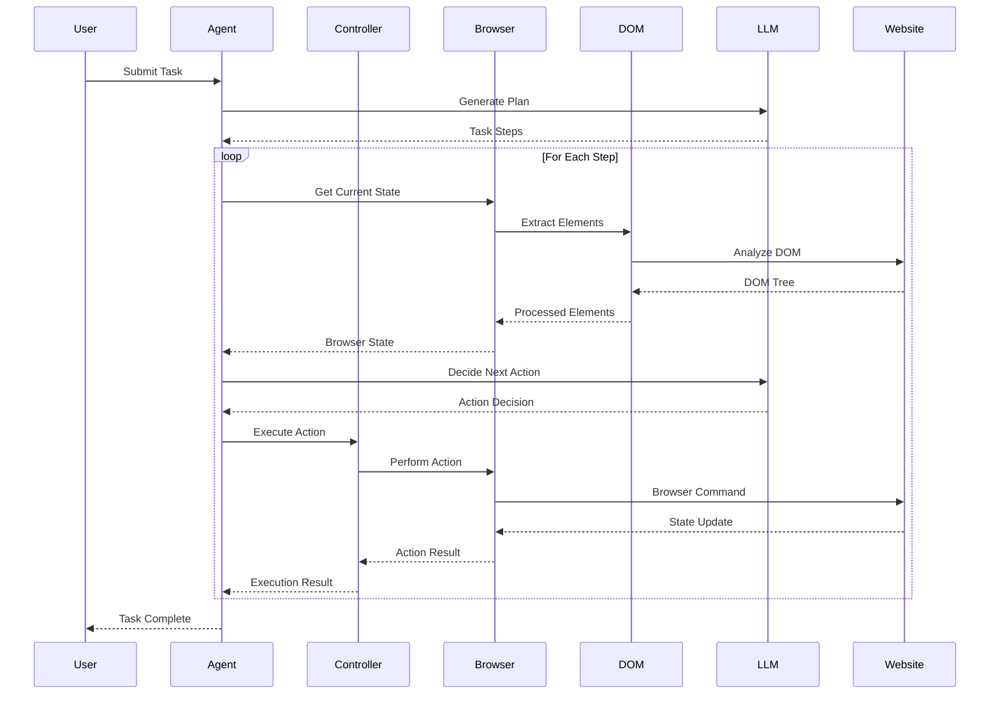
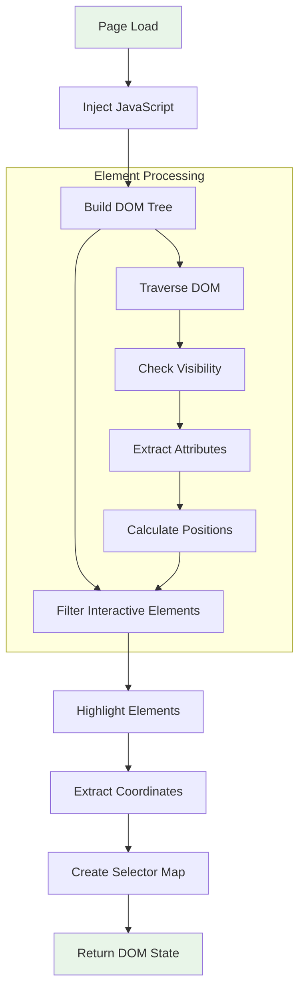

# Browser.AI Architecture Overview

## Introduction

Browser.AI is a sophisticated browser automation framework that makes websites accessible for AI agents. It combines AI-powered decision-making with robust browser automation capabilities through a modular architecture built on top of Playwright.

## High-Level Architecture



## Component Architecture

### 1. AI Agent Service (`browser_ai.agent`)

The central orchestrator that coordinates all browser automation tasks using AI decision-making.



**Key Responsibilities:**
- Task planning and execution orchestration
- LLM integration and prompt management
- Step-by-step action decision making
- Error handling and retry logic
- Conversation state management
- Vision capabilities for screenshot analysis

### 2. Action Controller (`browser_ai.controller`)

Manages the execution of browser actions through a registry pattern.



**Key Features:**
- Decorator-based action registration
- Type-safe action parameters using Pydantic
- Extensible action system
- Action exclusion capabilities
- Async execution support

### 3. Browser Service (`browser_ai.browser`)

Enhanced Playwright wrapper providing advanced browser management capabilities.



**Configuration Options:**
- Headless/headed mode control
- Security settings management
- Custom Chrome arguments
- WebSocket/CDP connection support
- Proxy configuration
- User agent customization

### 4. DOM Processing Service (`browser_ai.dom`)

Sophisticated DOM analysis and element extraction system.



**Key Capabilities:**
- Interactive element identification
- Smart element highlighting
- Viewport-aware element extraction
- XPath and CSS selector generation
- Element history tracking
- Shadow DOM support

## Data Flow Architecture

### Task Execution Flow



### DOM Processing Workflow



## Integration Points

### Language Model Integration

Browser.AI supports multiple LLM providers through LangChain:

- **OpenAI** (GPT-3.5, GPT-4, GPT-4V)
- **Anthropic** (Claude family)
- **Google** (Gemini family)
- **Ollama** (Local models)
- **Fireworks** (Fast inference)
- **AWS Bedrock** (Enterprise)

### Browser Engine Integration

Built on Playwright for cross-browser support:
- Chromium-based browsers
- Firefox
- WebKit (Safari)

### Observability Integration

- **LMNR** - Performance monitoring and debugging
- **Structured logging** - Comprehensive operation tracking
- **Conversation persistence** - Chat history management

## Configuration Management

### Environment Configuration

```bash
# LLM API Keys
OPENAI_API_KEY=your_openai_key
ANTHROPIC_API_KEY=your_anthropic_key

# Logging Configuration
BROWSER_AI_LOGGING_LEVEL=info  # result | debug | info
```

### Browser Configuration

```python
from browser_ai import BrowserConfig

config = BrowserConfig(
    headless=False,
    disable_security=True,
    extra_chromium_args=['--no-sandbox'],
    chrome_instance_path='/path/to/chrome'
)
```

## Scalability and Performance

### Async Architecture
- Full async/await support throughout the stack
- Concurrent action execution capabilities
- Non-blocking LLM communication

### Memory Management
- Automatic garbage collection for browser resources
- DOM tree caching with smart invalidation
- Message history size limits

### Error Handling
- Comprehensive retry mechanisms
- Graceful degradation for LLM failures
- Browser crash recovery

## Security Considerations

### Data Protection
- Sensitive data masking in logs
- Secure API key management
- No data persistence by default

### Browser Security
- Configurable security settings
- Sandbox environment support
- User agent rotation capabilities

---

*This architecture overview provides the foundation for understanding Browser.AI's modular design and integration capabilities. For detailed implementation guides, refer to the component-specific documentation.*