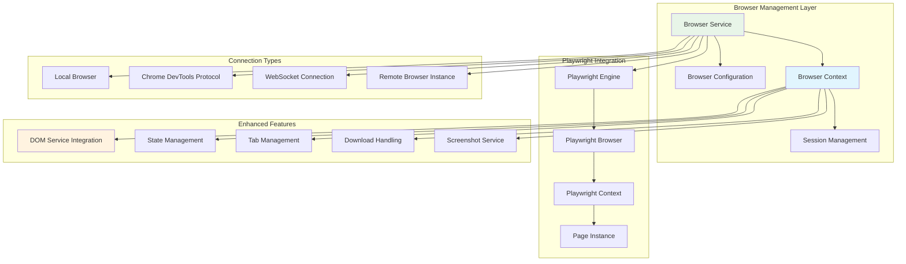
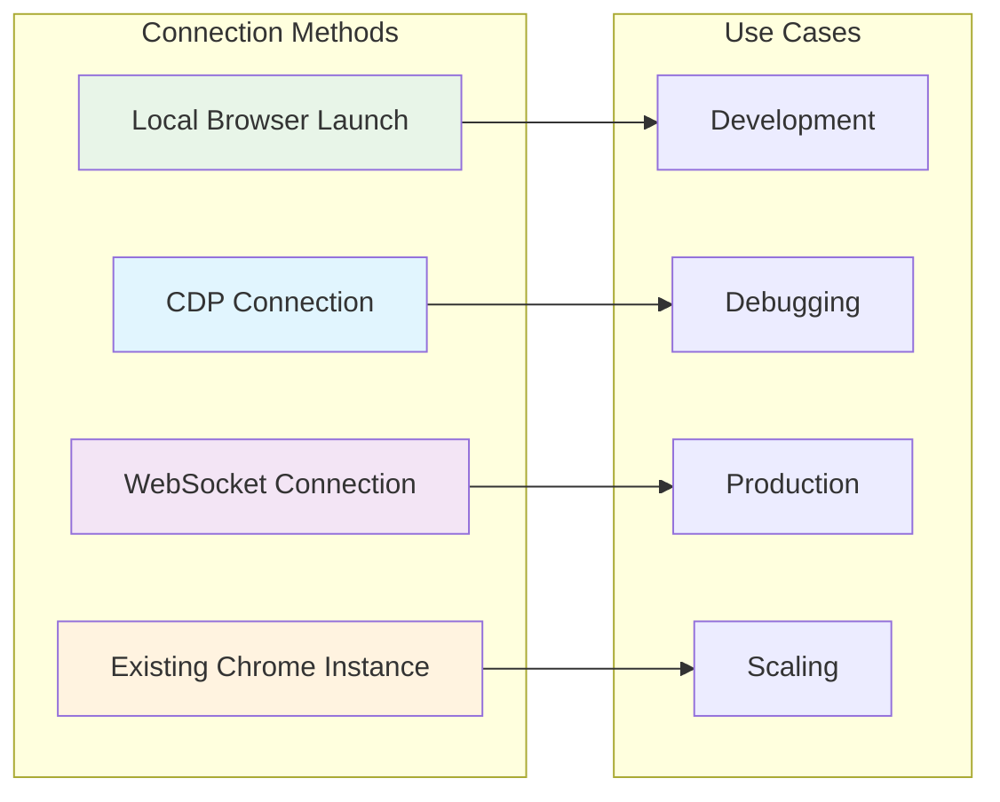
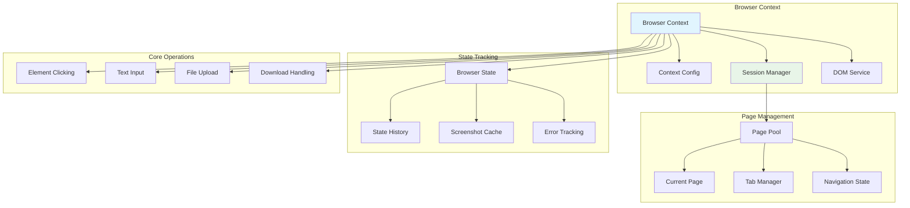
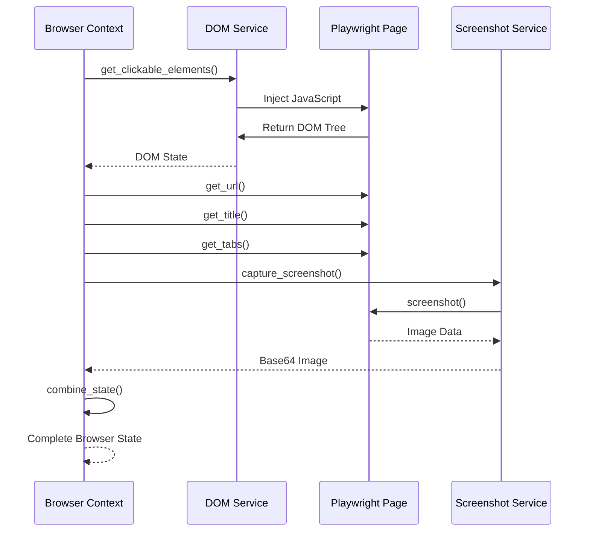
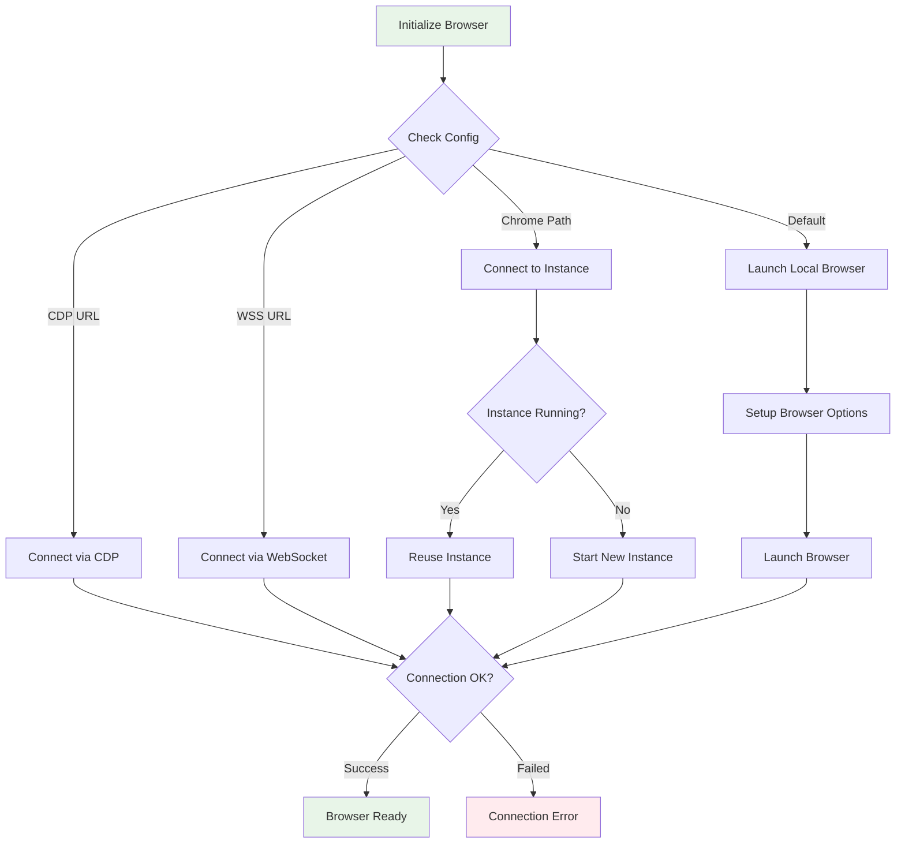

# Browser Management and Playwright Integration

## Overview

The Browser.AI Browser Management system provides a sophisticated wrapper around Playwright, offering enhanced browser automation capabilities with advanced configuration options, context management, and state tracking. It serves as the foundation for all browser interactions in the Browser.AI framework.

## Architecture

### Browser Management Components



### Core Browser Class

```python
class Browser:
    """
    Playwright browser on steroids.
    
    This is persistent browser factory that can spawn multiple browser contexts.
    It is recommended to use only one instance of Browser per application (RAM usage).
    """
    
    def __init__(self, config: BrowserConfig = BrowserConfig()):
        self.config = config
        self.playwright: Playwright | None = None
        self.playwright_browser: PlaywrightBrowser | None = None
        self.disable_security_args = []
        
        if self.config.disable_security:
            self.disable_security_args = [
                '--disable-web-security',
                '--disable-site-isolation-trials', 
                '--disable-features=IsolateOrigins,site-per-process',
            ]
```

## Browser Configuration System

### BrowserConfig Class

```python
@dataclass
class BrowserConfig:
    """Configuration for the Browser"""
    
    headless: bool = False                        # Run in headless mode
    disable_security: bool = True                 # Disable browser security features
    extra_chromium_args: list[str] = field(default_factory=list)  # Custom Chrome args
    chrome_instance_path: str | None = None       # Path to Chrome executable
    wss_url: str | None = None                   # WebSocket connection URL
    cdp_url: str | None = None                   # Chrome DevTools Protocol URL
    proxy: ProxySettings | None = field(default=None)  # Proxy configuration
    new_context_config: BrowserContextConfig = field(default_factory=BrowserContextConfig)
    _force_keep_browser_alive: bool = False      # Keep browser alive after context closes
```

### Configuration Options Deep Dive

#### Security Configuration

```python
# Development mode with security disabled
config = BrowserConfig(
    headless=False,
    disable_security=True,  # Enables:
    # --disable-web-security
    # --disable-site-isolation-trials  
    # --disable-features=IsolateOrigins,site-per-process
)

# Production mode with security enabled
config = BrowserConfig(
    headless=True,
    disable_security=False,
    extra_chromium_args=[
        '--no-sandbox',  # For containerized environments
        '--disable-dev-shm-usage',
    ]
)
```

#### Connection Types



##### 1. Local Browser Launch (Default)

```python
config = BrowserConfig(
    headless=False,
    extra_chromium_args=[
        '--disable-blink-features=AutomationControlled',
        '--user-agent=Custom User Agent String'
    ]
)
browser = Browser(config)
```

##### 2. Chrome DevTools Protocol (CDP)

```python
config = BrowserConfig(
    cdp_url='http://localhost:9222',  # Local Chrome with --remote-debugging-port=9222
    # or
    cdp_url='http://remote-server:9222',  # Remote Chrome instance
)
browser = Browser(config)
```

##### 3. WebSocket Connection

```python
config = BrowserConfig(
    wss_url='wss://chrome.browserless.io?token=your-token',
)
browser = Browser(config)
```

##### 4. Existing Chrome Instance

```python
config = BrowserConfig(
    chrome_instance_path='/Applications/Google Chrome.app/Contents/MacOS/Google Chrome',
    # Will automatically start Chrome with debugging port if not running
)
browser = Browser(config)
```

#### Proxy Configuration

```python
from playwright._impl._api_structures import ProxySettings

config = BrowserConfig(
    proxy=ProxySettings(
        server="http://proxy-server:8080",
        username="proxy_user",
        password="proxy_pass"
    )
)
```

## Browser Context Management

### BrowserContext Architecture



### BrowserContextConfig

```python
@dataclass
class BrowserContextConfig:
    """Configuration for browser context"""
    
    minimum_wait_page_load_time: float = 0.5     # Minimum page load wait
    maximum_wait_page_load_time: float = 5.0     # Maximum page load wait
    
    wait_for_network_idle_page_load_time: float = 1.0  # Network idle timeout
    disable_security: bool = True                 # Security settings
    
    browser_window_size: BrowserContextWindowSize = field(
        default_factory=lambda: BrowserContextWindowSize(width=1280, height=1080)
    )
    
    trace_path: Optional[str] = None             # Playwright trace file path
    save_recording_path: Optional[str] = None     # Screen recording path
    
    disable_web_security: bool = True            # Web security bypass
    ignore_https_errors: bool = True             # HTTPS certificate errors
    
    user_agent: Optional[str] = None             # Custom user agent
    
    cookie_banner_selectors: list[str] = field(default_factory=lambda: [
        '[class*="cookie"] button',
        '[id*="cookie"] button', 
        '[class*="consent"] button',
        '[id*="consent"] button'
    ])
```

### Context Lifecycle

```python
class BrowserContext:
    """Enhanced browser context with state management"""
    
    def __init__(
        self,
        browser: Browser,
        config: BrowserContextConfig = BrowserContextConfig()
    ):
        self.browser = browser
        self.config = config
        self.context: PlaywrightBrowserContext | None = None
        self.session_id = str(uuid.uuid4())
        self.dom_service: DomService | None = None
        
    async def get_session(self) -> 'BrowserContextSession':
        """Get or create browser session"""
        if not self.context:
            await self._create_context()
        return BrowserContextSession(self)
```

## Browser State Management

### BrowserState Structure

```python
@dataclass 
class BrowserState(DOMState):
    """Complete browser state snapshot"""
    
    url: str                                    # Current URL
    title: str                                  # Page title
    tabs: list[TabInfo]                        # All open tabs
    screenshot: Optional[str] = None            # Base64 screenshot
    pixels_above: int = 0                      # Pixels above viewport
    pixels_below: int = 0                      # Pixels below viewport
    browser_errors: list[str] = field(default_factory=list)  # Error messages

class TabInfo(BaseModel):
    """Information about a browser tab"""
    
    page_id: int                               # Tab identifier
    url: str                                   # Tab URL
    title: str                                 # Tab title
```

### State Capture Process



### Advanced State Features

#### Viewport Analysis

```python
async def get_current_state(
    self,
    use_vision: bool = True,
    max_screenshot_height: int | None = None
) -> BrowserState:
    """Capture complete browser state with viewport analysis"""
    
    page = await self.get_current_page()
    
    # Calculate viewport metrics
    viewport_size = page.viewport_size
    scroll_position = await page.evaluate('({x: window.scrollX, y: window.scrollY})')
    document_size = await page.evaluate('''
        ({
            width: document.documentElement.scrollWidth,
            height: document.documentElement.scrollHeight
        })
    ''')
    
    # Calculate pixels above and below viewport
    pixels_above = scroll_position['y']
    pixels_below = max(0, document_size['height'] - scroll_position['y'] - viewport_size['height'])
    
    return BrowserState(
        url=page.url,
        title=await page.title(),
        tabs=await self._get_tabs(),
        screenshot=await self._capture_screenshot() if use_vision else None,
        pixels_above=pixels_above,
        pixels_below=pixels_below,
        **dom_state_dict
    )
```

#### Error Tracking

```python
async def _setup_error_tracking(self, page: Page):
    """Setup comprehensive error tracking"""
    
    # Console error tracking
    page.on('console', lambda msg: 
        self._handle_console_message(msg) if msg.type in ['error', 'warning'] else None
    )
    
    # Network error tracking  
    page.on('response', lambda response:
        self._handle_network_error(response) if response.status >= 400 else None
    )
    
    # JavaScript error tracking
    page.on('pageerror', self._handle_page_error)
    
    # Request failure tracking
    page.on('requestfailed', self._handle_request_failed)

async def _handle_console_message(self, msg):
    error_info = f"Console {msg.type}: {msg.text}"
    self.current_errors.append(error_info)
    logger.warning(error_info)
```

## Advanced Browser Operations

### Element Interaction

#### Smart Click Implementation

```python
async def _click_element_node(self, element_node: DOMElementNode) -> Optional[str]:
    """Enhanced element clicking with download detection"""
    
    page = await self.get_current_page()
    
    # Setup download handling
    download_path = None
    download_started = asyncio.Event()
    
    async def handle_download(download):
        nonlocal download_path
        download_path = await self._handle_download(download)
        download_started.set()
    
    page.on('download', handle_download)
    
    try:
        # Multiple click strategies
        if element_node.xpath:
            # Primary: XPath-based click
            await page.click(f'xpath={element_node.xpath}', timeout=10000)
        else:
            # Fallback: Coordinate-based click
            coords = element_node.viewport_coordinates
            if coords:
                await page.mouse.click(coords.center.x, coords.center.y)
            else:
                raise ValueError("No valid click target found")
        
        # Wait for potential download
        try:
            await asyncio.wait_for(download_started.wait(), timeout=2.0)
        except asyncio.TimeoutError:
            pass  # No download started
            
    finally:
        page.remove_listener('download', handle_download)
    
    return download_path
```

#### Text Input with Smart Clearing

```python
async def _input_text_element_node(self, element_node: DOMElementNode, text: str):
    """Enhanced text input with smart field clearing"""
    
    page = await self.get_current_page()
    
    if element_node.xpath:
        locator = page.locator(f'xpath={element_node.xpath}')
        
        # Smart field clearing
        await locator.click()  # Focus the element
        await locator.press('Meta+A' if platform.system() == 'Darwin' else 'Control+A')  # Select all
        await locator.press('Backspace')  # Clear selection
        
        # Input new text
        await locator.type(text, delay=50)  # Slight delay for natural typing
    else:
        raise ValueError("No valid input target found")
```

### Tab Management

```python
async def switch_to_tab(self, page_id: int):
    """Switch to specific tab by ID"""
    
    pages = self.context.pages
    if page_id < 0:
        # Negative indexing support
        page_id = len(pages) + page_id
        
    if 0 <= page_id < len(pages):
        target_page = pages[page_id]
        await target_page.bring_to_front()
        await target_page.wait_for_load_state('networkidle')
    else:
        raise ValueError(f"Tab {page_id} does not exist")

async def create_new_tab(self, url: str) -> Page:
    """Create new tab with URL"""
    
    new_page = await self.context.new_page()
    await new_page.goto(url)
    await new_page.wait_for_load_state('networkidle')
    await new_page.bring_to_front()
    
    return new_page

async def close_tab(self, page_id: int):
    """Close specific tab"""
    
    pages = self.context.pages
    if len(pages) <= 1:
        raise ValueError("Cannot close the last remaining tab")
        
    if 0 <= page_id < len(pages):
        await pages[page_id].close()
    else:
        raise ValueError(f"Tab {page_id} does not exist")
```

### File Operations

#### Download Management

```python
async def _handle_download(self, download) -> str:
    """Handle file downloads with proper organization"""
    
    # Create downloads directory
    downloads_dir = Path('./downloads')
    downloads_dir.mkdir(exist_ok=True)
    
    # Generate safe filename
    suggested_filename = download.suggested_filename
    safe_filename = re.sub(r'[^a-zA-Z0-9._-]', '_', suggested_filename)
    
    # Handle filename conflicts
    download_path = downloads_dir / safe_filename
    counter = 1
    while download_path.exists():
        name, ext = os.path.splitext(safe_filename)
        download_path = downloads_dir / f"{name}_{counter}{ext}"
        counter += 1
    
    # Save download
    await download.save_as(str(download_path))
    logger.info(f"Downloaded file: {download_path}")
    
    return str(download_path)
```

#### File Upload Handling

```python
async def is_file_uploader(self, element_node: DOMElementNode) -> bool:
    """Detect if element opens file upload dialog"""
    
    # Check for file input elements
    if element_node.tag_name.lower() == 'input':
        input_type = element_node.attributes.get('type', '').lower()
        if input_type == 'file':
            return True
    
    # Check for file upload triggers
    upload_indicators = [
        'upload', 'file', 'attach', 'browse',
        'choose file', 'select file'
    ]
    
    element_text = element_node.get_all_text_till_next_clickable_element().lower()
    return any(indicator in element_text for indicator in upload_indicators)

async def upload_file(self, element_node: DOMElementNode, file_path: str):
    """Upload file to element"""
    
    if not await self.is_file_uploader(element_node):
        raise ValueError("Element is not a file upload element")
    
    page = await self.get_current_page()
    
    if element_node.xpath:
        file_input = page.locator(f'xpath={element_node.xpath}')
        await file_input.set_input_files(file_path)
    else:
        raise ValueError("Cannot upload file without element locator")
```

### Screenshot and Visual Features

#### Enhanced Screenshot Capture

```python
async def _capture_screenshot(
    self,
    full_page: bool = False,
    highlight_elements: bool = True,
    max_height: Optional[int] = None
) -> str:
    """Capture enhanced screenshot with highlighting"""
    
    page = await self.get_current_page()
    
    screenshot_options = {
        'full_page': full_page,
        'type': 'png',
    }
    
    # Apply height limit for large pages
    if max_height and full_page:
        current_viewport = page.viewport_size
        screenshot_options.update({
            'full_page': False,
            'clip': {
                'x': 0,
                'y': 0,
                'width': current_viewport['width'],
                'height': min(max_height, current_viewport['height'])
            }
        })
    
    # Capture screenshot
    screenshot_bytes = await page.screenshot(**screenshot_options)
    
    # Convert to base64 for transport
    screenshot_base64 = base64.b64encode(screenshot_bytes).decode()
    
    return screenshot_base64
```

#### Element Highlighting Integration

The browser context integrates with the DOM service's highlighting system:

```python
async def get_current_state_with_highlighting(
    self,
    focus_element: int = -1,
    viewport_expansion: int = 0
) -> BrowserState:
    """Get browser state with visual element highlighting"""
    
    # Get DOM state with highlighting
    dom_state = await self.dom_service.get_clickable_elements(
        highlight_elements=True,
        focus_element=focus_element,
        viewport_expansion=viewport_expansion
    )
    
    # Capture screenshot with highlighted elements
    screenshot = await self._capture_screenshot(full_page=False)
    
    return BrowserState(
        element_tree=dom_state.element_tree,
        selector_map=dom_state.selector_map,
        url=await self._get_url(),
        title=await self._get_title(),
        tabs=await self._get_tabs(),
        screenshot=screenshot
    )
```

## Connection Management

### Browser Initialization Strategies



### CDP Connection Implementation

```python
async def _setup_cdp(self, playwright: Playwright) -> PlaywrightBrowser:
    """Connect to browser via Chrome DevTools Protocol"""
    
    if not self.config.cdp_url:
        raise ValueError('CDP URL is required')
        
    logger.info(f'Connecting to remote browser via CDP {self.config.cdp_url}')
    
    try:
        browser = await playwright.chromium.connect_over_cdp(
            self.config.cdp_url,
            timeout=20000  # 20 second timeout
        )
        
        # Validate connection
        contexts = browser.contexts
        logger.info(f'Connected to browser with {len(contexts)} existing contexts')
        
        return browser
        
    except Exception as e:
        logger.error(f'Failed to connect via CDP: {e}')
        raise BrowserError(f'CDP connection failed: {e}')
```

### Chrome Instance Management

```python
async def _setup_browser_with_instance(self, playwright: Playwright) -> PlaywrightBrowser:
    """Connect to or start Chrome instance"""
    
    if not self.config.chrome_instance_path:
        raise ValueError('Chrome instance path is required')
        
    # Check for existing instance
    try:
        response = requests.get('http://localhost:9222/json/version', timeout=2)
        if response.status_code == 200:
            logger.info('Reusing existing Chrome instance')
            return await playwright.chromium.connect_over_cdp(
                endpoint_url='http://localhost:9222',
                timeout=20000
            )
    except requests.ConnectionError:
        logger.debug('No existing Chrome instance found, starting new one')
    
    # Start new instance
    chrome_args = [
        self.config.chrome_instance_path,
        '--remote-debugging-port=9222',
        '--no-first-run',
        '--no-default-browser-check',
        '--disable-default-apps',
        *self.config.extra_chromium_args
    ]
    
    subprocess.Popen(chrome_args)
    
    # Wait for Chrome to start
    for attempt in range(10):
        try:
            await asyncio.sleep(1)
            return await playwright.chromium.connect_over_cdp(
                endpoint_url='http://localhost:9222',
                timeout=20000
            )
        except Exception:
            if attempt == 9:
                raise BrowserError('Failed to start Chrome instance')
            continue
```

## Performance Optimization

### Memory Management

```python
class Browser:
    async def __aenter__(self):
        """Async context manager entry"""
        await self._init()
        return self
    
    async def __aexit__(self, exc_type, exc_val, exc_tb):
        """Async context manager exit with cleanup"""
        await self.close()
    
    async def close(self):
        """Clean browser resources"""
        if self.playwright_browser:
            await self.playwright_browser.close()
            
        if self.playwright:
            await self.playwright.stop()
            
        # Force garbage collection
        gc.collect()
        
        logger.debug('Browser resources cleaned up')
```

### Context Pool Management

```python
class BrowserContextPool:
    """Manage multiple browser contexts efficiently"""
    
    def __init__(self, browser: Browser, max_contexts: int = 5):
        self.browser = browser
        self.max_contexts = max_contexts
        self.contexts: list[BrowserContext] = []
        self.active_contexts: set[BrowserContext] = set()
    
    async def acquire_context(self) -> BrowserContext:
        """Get available context or create new one"""
        
        # Reuse idle context
        for context in self.contexts:
            if context not in self.active_contexts:
                self.active_contexts.add(context)
                return context
        
        # Create new context if under limit
        if len(self.contexts) < self.max_contexts:
            context = await self.browser.new_context()
            self.contexts.append(context)
            self.active_contexts.add(context)
            return context
        
        # Wait for context to become available
        raise BrowserError("No contexts available, increase max_contexts or wait")
    
    async def release_context(self, context: BrowserContext):
        """Release context back to pool"""
        if context in self.active_contexts:
            self.active_contexts.remove(context)
            
            # Reset context state
            await context.reset_state()
```

## Error Handling and Recovery

### Browser Error Types

```python
class BrowserError(Exception):
    """Base class for all browser errors"""
    pass

class URLNotAllowedError(BrowserError):
    """Raised when attempting to navigate to disallowed URL"""
    pass

class ElementNotFoundError(BrowserError):
    """Raised when element cannot be located"""
    pass

class ContextClosedError(BrowserError):
    """Raised when browser context is closed unexpectedly"""
    pass
```

### Recovery Strategies

```python
async def robust_operation(self, operation, max_retries: int = 3):
    """Execute operation with retry logic"""
    
    for attempt in range(max_retries):
        try:
            return await operation()
            
        except TimeoutError as e:
            if attempt < max_retries - 1:
                logger.warning(f"Operation timed out, retrying... (attempt {attempt + 1})")
                await asyncio.sleep(2 ** attempt)  # Exponential backoff
                continue
            raise BrowserError(f"Operation failed after {max_retries} attempts: {e}")
            
        except ElementNotFoundError as e:
            if attempt < max_retries - 1:
                logger.warning("Element not found, refreshing page state...")
                await self.refresh_page_state()
                continue
            raise
            
        except Exception as e:
            logger.error(f"Unexpected error in browser operation: {e}")
            raise BrowserError(f"Browser operation failed: {e}")
```

## Usage Examples

### Basic Browser Usage

```python
import asyncio
from browser_ai import Browser, BrowserConfig

async def basic_example():
    # Create browser with custom configuration
    config = BrowserConfig(
        headless=False,
        disable_security=True,
        extra_chromium_args=['--disable-blink-features=AutomationControlled']
    )
    
    async with Browser(config) as browser:
        # Create browser context
        context = await browser.new_context()
        
        # Navigate and interact
        page = await context.get_current_page()
        await page.goto('https://example.com')
        
        # Get current state
        state = await context.get_current_state()
        print(f"Page title: {state.title}")
        print(f"Interactive elements: {len(state.selector_map)}")

asyncio.run(basic_example())
```

### Advanced Configuration

```python
from browser_ai import Browser, BrowserConfig, BrowserContextConfig
from playwright._impl._api_structures import ProxySettings

async def advanced_example():
    # Advanced browser configuration
    browser_config = BrowserConfig(
        headless=True,
        disable_security=False,  # Production security
        proxy=ProxySettings(
            server="http://proxy-server:8080",
            username="user",
            password="pass"
        ),
        extra_chromium_args=[
            '--no-sandbox',
            '--disable-dev-shm-usage',
            '--disable-gpu'
        ]
    )
    
    # Advanced context configuration
    context_config = BrowserContextConfig(
        browser_window_size={'width': 1920, 'height': 1080},
        user_agent='Mozilla/5.0 (Custom Browser AI Agent)',
        trace_path='./traces/session.trace',
        save_recording_path='./recordings/session.webm'
    )
    
    browser_config.new_context_config = context_config
    
    async with Browser(browser_config) as browser:
        context = await browser.new_context(context_config)
        
        # Perform automation with full configuration
        state = await context.get_current_state(use_vision=True)
        
        # Access enhanced features
        if state.pixels_below > 0:
            print(f"Page extends {state.pixels_below} pixels below viewport")

asyncio.run(advanced_example())
```

### Remote Browser Connection

```python
async def remote_browser_example():
    # Connect to remote browser service
    config = BrowserConfig(
        wss_url='wss://chrome.browserless.io?token=your-token'
    )
    
    async with Browser(config) as browser:
        context = await browser.new_context()
        
        # Use remote browser as if it were local
        page = await context.get_current_page()
        await page.goto('https://example.com')
        
        state = await context.get_current_state()
        print(f"Connected to remote browser: {state.url}")

asyncio.run(remote_browser_example())
```

## Best Practices

### 1. Resource Management

```python
# Always use context managers for automatic cleanup
async with Browser(config) as browser:
    async with await browser.new_context() as context:
        # Browser operations
        pass
# Resources automatically cleaned up
```

### 2. Error Handling

```python
from browser_ai.browser.views import BrowserError

try:
    state = await context.get_current_state()
except BrowserError as e:
    logger.error(f"Browser operation failed: {e}")
    # Implement fallback strategy
except Exception as e:
    logger.exception(f"Unexpected error: {e}")
    # Handle unexpected errors
```

### 3. Performance Optimization

```python
# Reuse browser instances
browser = Browser(config)

# Use context pooling for multiple operations
contexts = []
for i in range(3):
    contexts.append(await browser.new_context())

# Limit screenshot capture for performance
state = await context.get_current_state(
    use_vision=False,  # Disable screenshots when not needed
    max_screenshot_height=1200  # Limit screenshot size
)
```

---

*This documentation provides comprehensive coverage of the Browser Management system, showcasing the sophisticated integration with Playwright and the enhanced capabilities for browser automation.*