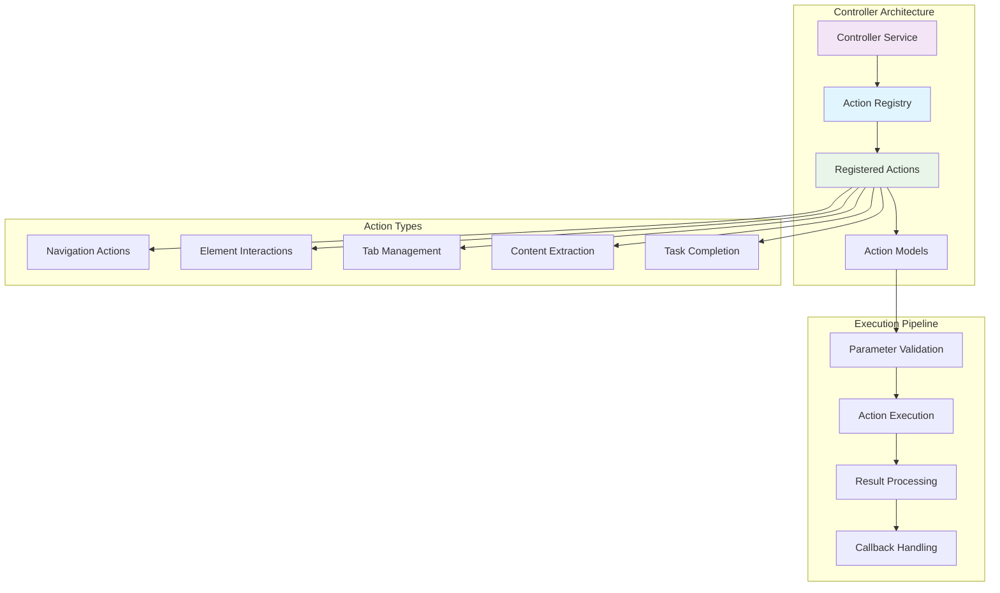
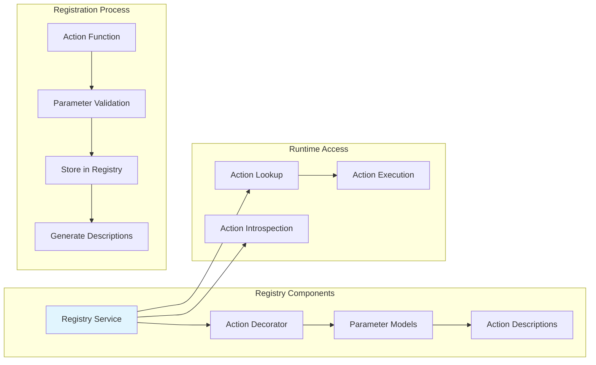
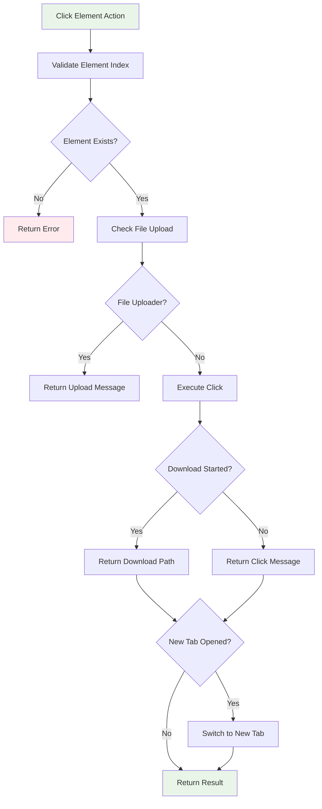
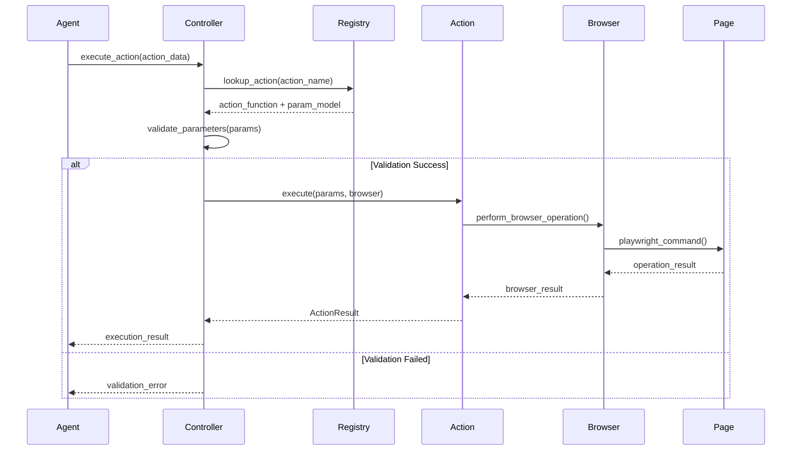
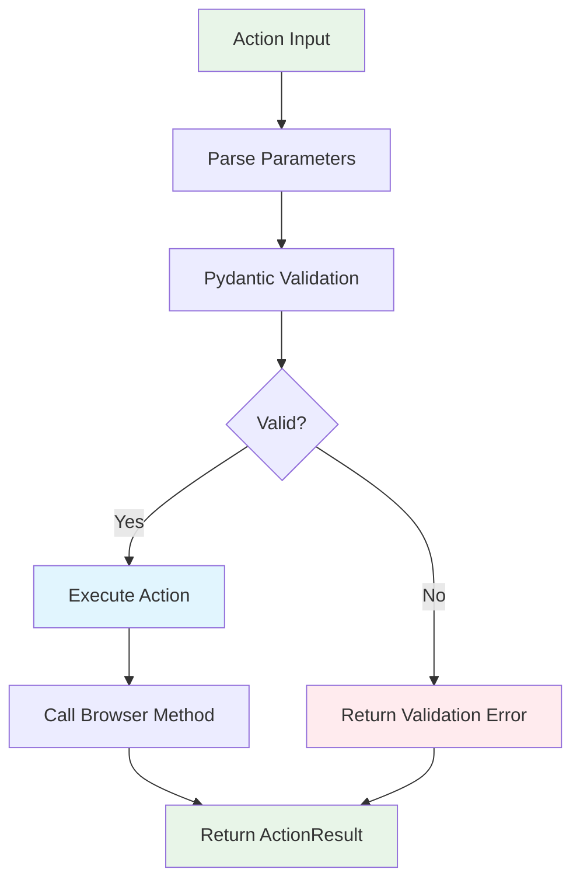

# Controller and Action System

## Overview

The Browser.AI Controller and Action System provides a flexible, extensible framework for defining and executing browser automation actions. It uses a registry pattern with decorator-based action registration, type-safe parameter validation through Pydantic models, and async execution support.

## Architecture

### Controller System Components



### Core Controller Class

```python
class Controller:
    def __init__(
        self,
        exclude_actions: list[str] = [],           # Actions to exclude from registry
        output_model: Optional[Type[BaseModel]] = None,  # Custom output model
    ):
        self.exclude_actions = exclude_actions
        self.output_model = output_model
        self.registry = Registry(exclude_actions)
        self._register_default_actions()
```

## Action Registry System

### Registry Architecture



### Action Registration Decorator

```python
class Registry:
    """Service for registering and managing actions"""
    
    def action(
        self,
        description: str,                              # Human-readable description
        param_model: Optional[Type[BaseModel]] = None, # Parameter validation model
    ):
        """Decorator for registering actions"""
        
        def decorator(func: Callable):
            # Skip registration if action is in exclude_actions
            if func.__name__ in self.exclude_actions:
                return func
            
            # Create parameter model if not provided
            if param_model is None:
                param_model = self._create_param_model(func)
            
            # Register action
            registered_action = RegisteredAction(
                name=func.__name__,
                description=description,
                function=func,
                param_model=param_model
            )
            
            self.registry.actions[func.__name__] = registered_action
            return func
        
        return decorator
```

### Dynamic Parameter Model Creation

```python
def _create_param_model(self, function: Callable) -> Type[BaseModel]:
    """Creates a Pydantic model from function signature"""
    sig = signature(function)
    params = {
        name: (param.annotation, ... if param.default == param.empty else param.default)
        for name, param in sig.parameters.items()
        if name not in ['browser', 'page_extraction_llm', 'available_file_paths']
    }
    
    return create_model(
        f'{function.__name__}_parameters',
        __base__=ActionModel,
        **params,
    )
```

## Built-in Action Types

### 1. Navigation Actions

#### Search Google

```python
@self.registry.action(
    'Search the query in Google in the current tab, the query should be a search query like humans search in Google, concrete and not vague or super long.',
    param_model=SearchGoogleAction,
)
async def search_google(params: SearchGoogleAction, browser: BrowserContext):
    page = await browser.get_current_page()
    await page.goto(f'https://www.google.com/search?q={params.query}&udm=14')
    await page.wait_for_load_state()
    msg = f'🔍  Searched for "{params.query}" in Google'
    logger.info(msg)
    return ActionResult(extracted_content=msg, include_in_memory=True)

class SearchGoogleAction(BaseModel):
    query: str
```

#### Navigate to URL

```python
@self.registry.action('Navigate to URL in the current tab', param_model=GoToUrlAction)
async def go_to_url(params: GoToUrlAction, browser: BrowserContext):
    page = await browser.get_current_page()
    await page.goto(params.url)
    await page.wait_for_load_state()
    msg = f'🔗  Navigated to {params.url}'
    logger.info(msg)
    return ActionResult(extracted_content=msg, include_in_memory=True)

class GoToUrlAction(BaseModel):
    url: str
```

#### Navigation History

```python
@self.registry.action('Go back', param_model=NoParamsAction)
async def go_back(_: NoParamsAction, browser: BrowserContext):
    await browser.go_back()
    msg = '🔙  Navigated back'
    logger.info(msg)
    return ActionResult(extracted_content=msg, include_in_memory=True)
```

### 2. Element Interaction Actions

#### Click Element



```python
@self.registry.action('Click element', param_model=ClickElementAction)
async def click_element(params: ClickElementAction, browser: BrowserContext):
    session = await browser.get_session()
    state = session.cached_state
    
    if params.index not in state.selector_map:
        raise Exception(f'Element with index {params.index} does not exist - retry or use alternative actions')
    
    element_node = state.selector_map[params.index]
    initial_pages = len(session.context.pages)
    
    # Check for file upload elements
    if await browser.is_file_uploader(element_node):
        msg = f'Index {params.index} - has an element which opens file upload dialog. To upload files please use a specific function to upload files'
        logger.info(msg)
        return ActionResult(extracted_content=msg, include_in_memory=True)
    
    try:
        download_path = await browser._click_element_node(element_node)
        if download_path:
            msg = f'💾  Downloaded file to {download_path}'
        else:
            msg = f'🖱️  Clicked button with index {params.index}: {element_node.get_all_text_till_next_clickable_element(max_depth=2)}'
        
        logger.info(msg)
        
        # Handle new tab opening
        if len(session.context.pages) > initial_pages:
            new_tab_msg = 'New tab opened - switching to it'
            msg += f' - {new_tab_msg}'
            logger.info(new_tab_msg)
            await browser.switch_to_tab(-1)
            
        return ActionResult(extracted_content=msg, include_in_memory=True)
    except Exception as e:
        logger.warning(f'Element not clickable with index {params.index} - most likely the page changed')
        return ActionResult(error=str(e))

class ClickElementAction(BaseModel):
    index: int
    xpath: Optional[str] = None
```

#### Input Text

```python
@self.registry.action(
    'Input text into a input interactive element',
    param_model=InputTextAction,
)
async def input_text(params: InputTextAction, browser: BrowserContext):
    session = await browser.get_session()
    state = session.cached_state
    
    if params.index not in state.selector_map:
        raise Exception(f'Element index {params.index} does not exist - retry or use alternative actions')
    
    element_node = state.selector_map[params.index]
    await browser._input_text_element_node(element_node, params.text)
    msg = f'⌨️  Input {params.text} into index {params.index}'
    logger.info(msg)
    return ActionResult(extracted_content=msg, include_in_memory=True)

class InputTextAction(BaseModel):
    index: int
    text: str
    xpath: Optional[str] = None
```

### 3. Advanced Interaction Actions

#### Scroll Actions

```python
@self.registry.action('Scroll down', param_model=ScrollAction)
async def scroll(params: ScrollAction, browser: BrowserContext):
    page = await browser.get_current_page()
    
    if params.amount is not None:
        await page.mouse.wheel(0, params.amount)
        msg = f'📜  Scrolled {params.amount} pixels'
    else:
        await page.keyboard.press('PageDown')
        msg = '📜  Scrolled down one page'
    
    logger.info(msg)
    return ActionResult(extracted_content=msg, include_in_memory=True)

class ScrollAction(BaseModel):
    amount: Optional[int] = None  # Number of pixels to scroll
```

#### Send Keys

```python
@self.registry.action('Send key combination (e.g., Tab, Enter, Ctrl+A)', param_model=SendKeysAction)
async def send_keys(params: SendKeysAction, browser: BrowserContext):
    page = await browser.get_current_page()
    await page.keyboard.press(params.keys)
    msg = f'⌨️  Pressed keys: {params.keys}'
    logger.info(msg)
    return ActionResult(extracted_content=msg, include_in_memory=True)

class SendKeysAction(BaseModel):
    keys: str
```

### 4. Tab Management Actions

#### Switch Tab

```python
@self.registry.action('Switch tab', param_model=SwitchTabAction)
async def switch_tab(params: SwitchTabAction, browser: BrowserContext):
    await browser.switch_to_tab(params.page_id)
    page = await browser.get_current_page()
    await page.wait_for_load_state()
    msg = f'🔄  Switched to tab {params.page_id}'
    logger.info(msg)
    return ActionResult(extracted_content=msg, include_in_memory=True)

class SwitchTabAction(BaseModel):
    page_id: int
```

#### Open New Tab

```python
@self.registry.action('Open a new tab with the given URL', param_model=OpenTabAction)
async def open_tab(params: OpenTabAction, browser: BrowserContext):
    await browser.create_new_tab(params.url)
    msg = f'🆕  Opened new tab with URL: {params.url}'
    logger.info(msg)
    return ActionResult(extracted_content=msg, include_in_memory=True)

class OpenTabAction(BaseModel):
    url: str
```

### 5. Task Completion Actions

#### Done Action

```python
@self.registry.action('Complete task', param_model=DoneAction)
async def done(params: DoneAction):
    return ActionResult(is_done=True, extracted_content=params.text)

class DoneAction(BaseModel):
    text: str
```

#### Custom Output Models

```python
# For structured data extraction
if self.output_model is not None:
    @self.registry.action('Complete task', param_model=self.output_model)
    async def done(params: BaseModel):
        return ActionResult(is_done=True, extracted_content=params.model_dump_json())
```

## Action Execution Flow

### Complete Execution Pipeline



### Parameter Validation Process



## Advanced Action Features

### 1. Context Injection

Actions automatically receive browser context and other dependencies:

```python
@self.registry.action('Custom action with context')
async def custom_action(
    params: CustomParams,
    browser: BrowserContext,              # Auto-injected browser context
    page_extraction_llm: BaseChatModel,   # Auto-injected LLM for content extraction
    available_file_paths: list[str]       # Auto-injected file paths
):
    # Action implementation with full context access
    pass
```

### 2. Error Handling Patterns

```python
async def robust_action(params: ActionParams, browser: BrowserContext):
    try:
        # Primary action logic
        result = await browser.perform_operation()
        return ActionResult(extracted_content=f"Success: {result}")
        
    except ElementNotFoundError:
        # Specific error handling
        return ActionResult(error="Element not found - page may have changed")
        
    except Exception as e:
        # Generic error handling
        logger.warning(f"Action failed: {str(e)}")
        return ActionResult(error=str(e))
```

### 3. Smart Element Resolution

```python
async def smart_click(params: ClickElementAction, browser: BrowserContext):
    session = await browser.get_session()
    state = session.cached_state
    
    # Primary resolution: by index
    if params.index in state.selector_map:
        element_node = state.selector_map[params.index]
        return await browser._click_element_node(element_node)
    
    # Fallback resolution: by XPath
    if params.xpath:
        try:
            element = await browser.find_element_by_xpath(params.xpath)
            return await browser.click_element(element)
        except:
            pass
    
    # Error: element not found
    raise Exception(f'Element with index {params.index} not found')
```

## Action Model System

### Base Action Model

```python
class ActionModel(BaseModel):
    """Base model for dynamically created action models"""
    
    model_config = ConfigDict(arbitrary_types_allowed=True)
    
    def get_index(self) -> int | None:
        """Get the index of the action if present"""
        params = self.model_dump(exclude_unset=True).values()
        if not params:
            return None
        for param in params:
            if param is not None and 'index' in param:
                return param['index']
        return None
```

### Dynamic Action Model Generation

```python
def create_action_model(self) -> Type[ActionModel]:
    """Create a dynamic action model with all registered actions"""
    
    action_fields = {}
    for action_name, registered_action in self.actions.items():
        # Create optional field for each action
        action_fields[action_name] = (
            Optional[registered_action.param_model], 
            Field(default=None, description=registered_action.description)
        )
    
    # Create dynamic model
    return create_model(
        'DynamicActionModel',
        __base__=ActionModel,
        **action_fields
    )
```

### Action Result Processing

```python
class ActionResult(BaseModel):
    """Result of executing an action"""
    is_done: bool = False                    # Task completion indicator
    extracted_content: Optional[str] = None # Content extracted/message
    error: Optional[str] = None              # Error message if failed
    include_in_memory: bool = True           # Include in conversation memory
```

## Custom Action Development

### 1. Simple Custom Action

```python
from browser_ai import Controller
from pydantic import BaseModel

# Define parameter model
class CustomActionParams(BaseModel):
    target: str
    value: int

# Create controller
controller = Controller()

# Register custom action
@controller.registry.action(
    'Perform custom operation on target element',
    param_model=CustomActionParams
)
async def custom_action(params: CustomActionParams, browser: BrowserContext):
    # Custom action implementation
    result = f"Performed operation on {params.target} with value {params.value}"
    return ActionResult(extracted_content=result, include_in_memory=True)
```

### 2. Complex Custom Action with File Handling

```python
@controller.registry.action(
    'Upload file to element',
    param_model=FileUploadAction
)
async def upload_file(
    params: FileUploadAction,
    browser: BrowserContext,
    available_file_paths: list[str]
):
    # Validate file availability
    if params.file_path not in available_file_paths:
        return ActionResult(error=f"File {params.file_path} not available")
    
    # Get target element
    session = await browser.get_session()
    element_node = session.cached_state.selector_map[params.index]
    
    # Perform file upload
    await browser.upload_file(element_node, params.file_path)
    
    return ActionResult(
        extracted_content=f"Uploaded {params.file_path} to element {params.index}",
        include_in_memory=True
    )

class FileUploadAction(BaseModel):
    index: int
    file_path: str
```

### 3. Action with LLM Integration

```python
@controller.registry.action(
    'Extract and summarize page content',
    param_model=NoParamsAction
)
async def extract_content(
    params: NoParamsAction,
    browser: BrowserContext,
    page_extraction_llm: BaseChatModel
):
    # Get current page content
    page = await browser.get_current_page()
    content = await page.content()
    
    # Use LLM to extract key information
    prompt = f"Summarize the key information from this page: {content[:1000]}"
    response = await page_extraction_llm.ainvoke([HumanMessage(content=prompt)])
    
    return ActionResult(
        extracted_content=response.content,
        include_in_memory=True
    )
```

## Action Exclusion and Customization

### Excluding Default Actions

```python
# Exclude specific actions from the default set
controller = Controller(exclude_actions=['search_google', 'send_keys'])

# Only navigation and interaction actions will be available
# Custom actions can still be added
```

### Custom Output Models

```python
from pydantic import BaseModel

class CustomOutput(BaseModel):
    product_name: str
    price: float
    availability: bool

# Controller with custom completion model
controller = Controller(output_model=CustomOutput)

# The 'done' action will now expect structured output matching CustomOutput
```

## Performance and Best Practices

### 1. Async Action Design

```python
# Good: Proper async implementation
async def good_action(params: ActionParams, browser: BrowserContext):
    await browser.wait_for_element()
    result = await browser.click_element()
    return ActionResult(extracted_content=result)

# Avoid: Blocking operations
async def bad_action(params: ActionParams, browser: BrowserContext):
    time.sleep(5)  # Blocks the event loop
    return ActionResult(extracted_content="Done")
```

### 2. Error Handling Best Practices

```python
async def robust_action(params: ActionParams, browser: BrowserContext):
    try:
        # Main logic with specific exception handling
        result = await browser.perform_operation()
        
        # Always return ActionResult
        return ActionResult(
            extracted_content=f"Success: {result}",
            include_in_memory=True
        )
        
    except SpecificBrowserError as e:
        logger.warning(f"Browser operation failed: {e}")
        return ActionResult(error=f"Browser error: {str(e)}")
        
    except ValidationError as e:
        logger.error(f"Parameter validation failed: {e}")
        return ActionResult(error=f"Invalid parameters: {str(e)}")
        
    except Exception as e:
        logger.exception(f"Unexpected error in action: {e}")
        return ActionResult(error=f"Unexpected error: {str(e)}")
```

### 3. Memory Management

```python
async def memory_efficient_action(params: ActionParams, browser: BrowserContext):
    # Process large data in chunks
    result_parts = []
    
    for chunk in process_in_chunks(large_data):
        part_result = await process_chunk(chunk)
        result_parts.append(part_result)
        
        # Clean up chunk data
        del chunk
    
    final_result = combine_results(result_parts)
    
    # Control memory inclusion
    return ActionResult(
        extracted_content=final_result,
        include_in_memory=len(final_result) < 1000  # Only include small results
    )
```

## Integration Examples

### Basic Controller Usage

```python
from browser_ai import Controller, Browser, Agent
from langchain_openai import ChatOpenAI

async def main():
    # Create controller with custom actions
    controller = Controller(exclude_actions=['search_google'])
    
    # Add custom action
    @controller.registry.action('Custom search action')
    async def custom_search(params: SearchParams, browser: BrowserContext):
        # Custom implementation
        return ActionResult(extracted_content="Custom search completed")
    
    # Use controller with agent
    llm = ChatOpenAI(model="gpt-4")
    browser = Browser()
    
    agent = Agent(
        task="Perform web automation with custom actions",
        llm=llm,
        browser=browser,
        controller=controller
    )
    
    result = await agent.run()
    print(f"Task result: {result.extracted_content}")
```

### Advanced Custom Controller

```python
class CustomController(Controller):
    def __init__(self):
        super().__init__(exclude_actions=['send_keys'])
        self._register_custom_actions()
    
    def _register_custom_actions(self):
        """Register domain-specific actions"""
        
        @self.registry.action('Login with credentials')
        async def login(params: LoginParams, browser: BrowserContext):
            # Secure login implementation
            await browser.input_text(params.username_selector, params.username)
            await browser.input_text(params.password_selector, params.password)
            await browser.click(params.submit_selector)
            return ActionResult(extracted_content="Login completed")
        
        @self.registry.action('Extract product data')
        async def extract_product(params: ProductParams, browser: BrowserContext):
            # Product-specific extraction
            name = await browser.extract_text(params.name_selector)
            price = await browser.extract_text(params.price_selector)
            
            product_data = {"name": name, "price": price}
            return ActionResult(
                extracted_content=json.dumps(product_data),
                include_in_memory=True
            )

# Usage
custom_controller = CustomController()
agent = Agent(task="E-commerce automation", llm=llm, controller=custom_controller)
```

---

*This documentation provides comprehensive coverage of the Controller and Action System. The extensible design allows for easy customization while maintaining type safety and robust error handling.*