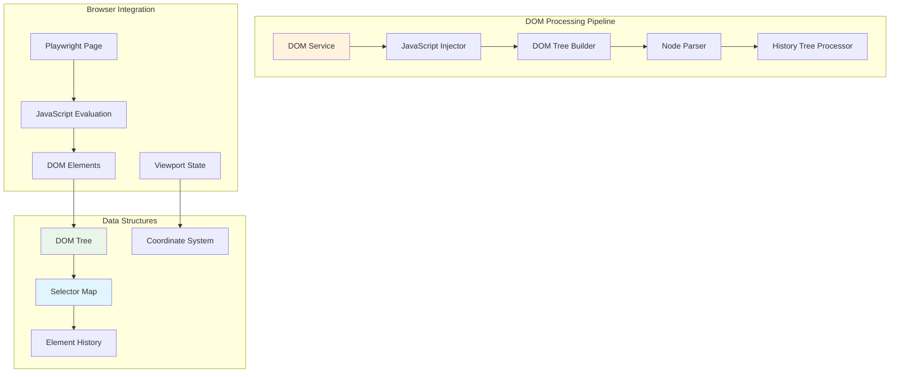
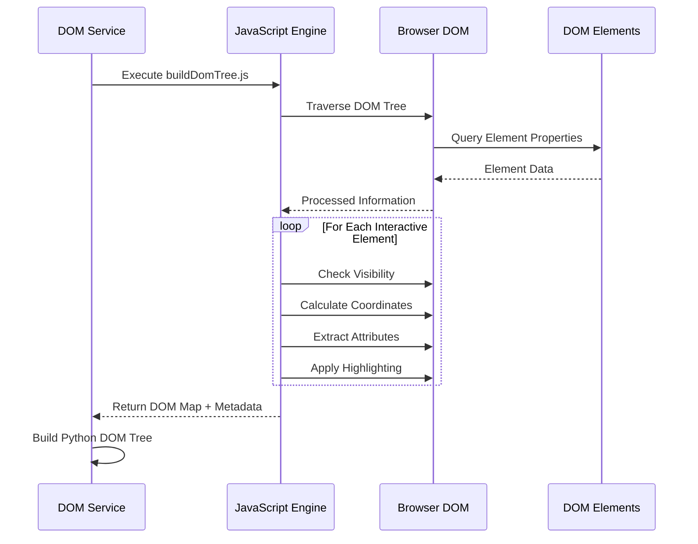
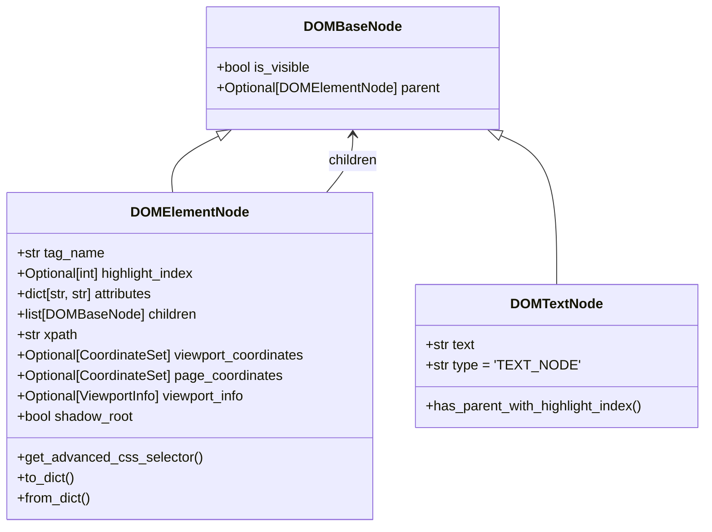
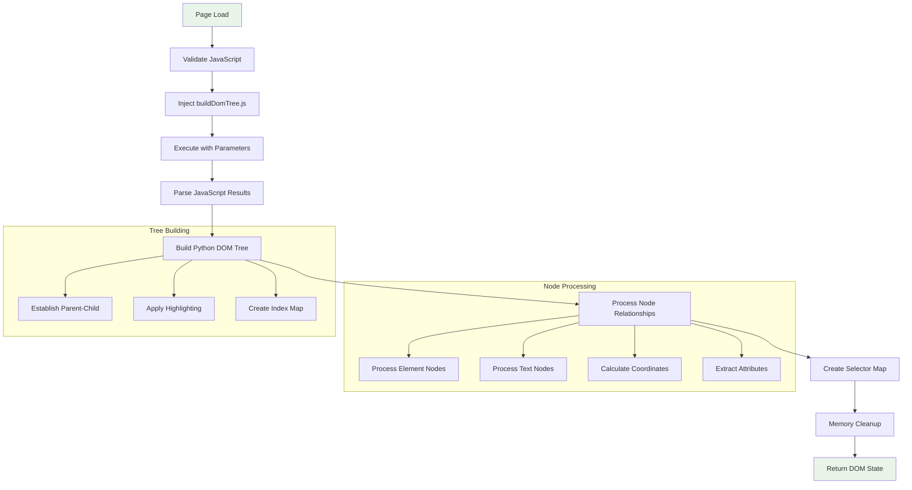
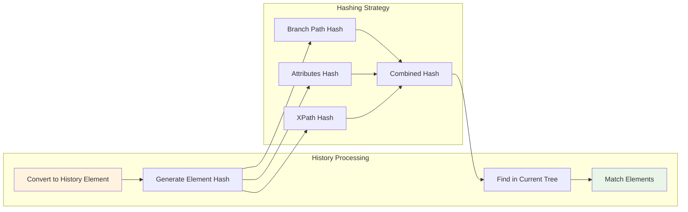
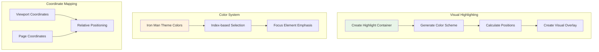
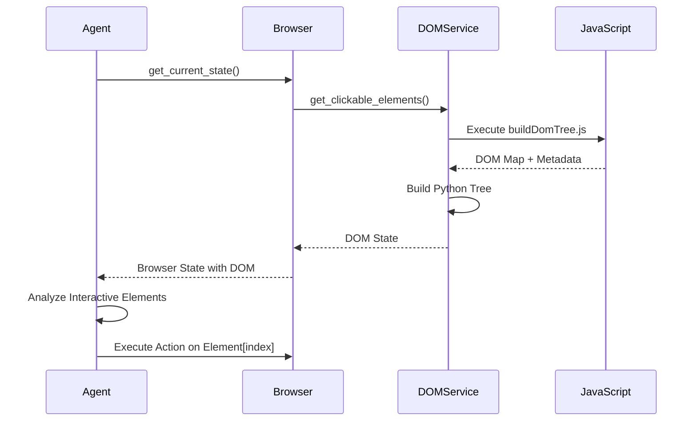

# DOM Processing and Element Extraction

## Overview

The Browser.AI DOM Processing Service is a sophisticated system that analyzes web pages, extracts interactive elements, and provides AI agents with structured information about the DOM. It combines JavaScript execution in the browser with Python-based processing to create a comprehensive understanding of web page structure and interactivity.

## Architecture

### DOM Service Components



### Core DOM Service Structure

```python
class DomService:
    def __init__(self, page: Page):
        self.page = page
        self.xpath_cache = {}
        self.js_code = resources.read_text('browser_ai.dom', 'buildDomTree.js')
    
    async def get_clickable_elements(
        self,
        highlight_elements: bool = True,
        focus_element: int = -1,
        viewport_expansion: int = 0,
    ) -> DOMState
```

## JavaScript DOM Tree Builder

### Client-Side DOM Analysis

The DOM processing begins with sophisticated JavaScript code executed in the browser that analyzes the page structure:

```javascript
// buildDomTree.js - Core DOM analysis engine
(args = {
    doHighlightElements: true,
    focusHighlightIndex: -1,
    viewportExpansion: 0,
}) => {
    const { doHighlightElements, focusHighlightIndex, viewportExpansion } = args;
    let highlightIndex = 0;
    
    const DOM_HASH_MAP = {};
    
    // Element highlighting and analysis functions
    function highlightElement(element, index, parentIframe = null) {
        // Visual highlighting with color-coded indices
        // Coordinate calculation and viewport analysis
    }
    
    function extractElementInfo(element) {
        // Extract all relevant element properties
        // Calculate positions and visibility
    }
}
```

### Element Analysis Process



### Element Selection Criteria

The JavaScript engine identifies interactive elements based on:

1. **Tag-based Selection**
   - Input elements (`input`, `textarea`, `select`)
   - Interactive elements (`button`, `a`, `label`)
   - Form elements (`form`, `fieldset`)

2. **Attribute-based Selection**
   - Elements with `onclick` handlers
   - Elements with `href` attributes
   - Elements with `tabindex`
   - Elements with ARIA roles

3. **Computed Style Analysis**
   - `cursor: pointer` elements
   - Non-zero dimensions
   - Visible elements (not `display: none`)

4. **Contextual Analysis**
   - Parent container interactivity
   - Event listener presence
   - Focus capability

## Python DOM Tree Structure

### DOM Node Hierarchy



### Data Structures

#### Coordinate System

```python
class Coordinates(BaseModel):
    x: int
    y: int

class CoordinateSet(BaseModel):
    top_left: Coordinates
    top_right: Coordinates
    bottom_left: Coordinates
    bottom_right: Coordinates
    center: Coordinates
    width: int
    height: int
```

#### Viewport Information

```python
class ViewportInfo(BaseModel):
    scroll_x: int
    scroll_y: int
    width: int
    height: int
```

#### DOM State

```python
class DOMState(BaseModel):
    element_tree: DOMElementNode      # Root of the DOM tree
    selector_map: SelectorMap         # Index -> Element mapping
```

## Element Processing Workflow

### Complete DOM Processing Pipeline



### Node Parsing Algorithm

```python
def _parse_node(self, node_data: dict) -> tuple[Optional[DOMBaseNode], list[int]]:
    """Parse JavaScript node data into Python DOM node"""
    
    # Handle text nodes
    if node_data.get('type') == 'TEXT_NODE':
        return DOMTextNode(
            text=node_data['text'],
            is_visible=node_data['isVisible'],
            parent=None
        ), []
    
    # Process element coordinates
    viewport_coordinates = None
    page_coordinates = None
    viewport_info = None
    
    # Extract coordinate information
    if 'viewportCoordinates' in node_data:
        viewport_coordinates = CoordinateSet(...)
        
    if 'pageCoordinates' in node_data:
        page_coordinates = CoordinateSet(...)
        
    if 'viewport' in node_data:
        viewport_info = ViewportInfo(...)
    
    # Create element node
    return DOMElementNode(...), children_ids
```

## History Tree Processing

### Element Tracking and Persistence

The History Tree Processor provides capabilities for tracking elements across page changes and maintaining element identity:



### Element Identity Management

```python
class HistoryTreeProcessor:
    """Operations on DOM elements for history tracking"""
    
    @staticmethod
    def convert_dom_element_to_history_element(
        dom_element: DOMElementNode
    ) -> DOMHistoryElement:
        """Convert current DOM element to history-trackable format"""
        
        parent_branch_path = HistoryTreeProcessor._get_parent_branch_path(dom_element)
        css_selector = dom_element.get_advanced_css_selector()
        
        return DOMHistoryElement(
            dom_element.tag_name,
            dom_element.xpath,
            dom_element.highlight_index,
            parent_branch_path,
            dom_element.attributes,
            dom_element.shadow_root,
            css_selector=css_selector,
            page_coordinates=dom_element.page_coordinates,
            viewport_coordinates=dom_element.viewport_coordinates,
            viewport_info=dom_element.viewport_info,
        )
    
    @staticmethod
    def find_history_element_in_tree(
        dom_history_element: DOMHistoryElement,
        tree: DOMElementNode
    ) -> Optional[DOMElementNode]:
        """Find historical element in current DOM tree"""
        
        hashed_history = HistoryTreeProcessor._hash_dom_history_element(dom_history_element)
        
        def process_node(node: DOMElementNode):
            if node.highlight_index is not None:
                hashed_node = HistoryTreeProcessor._hash_dom_element(node)
                if hashed_node == hashed_history:
                    return node
            
            for child in node.children:
                if isinstance(child, DOMElementNode):
                    result = process_node(child)
                    if result is not None:
                        return result
            return None
        
        return process_node(tree)
```

### Element Hashing Strategy

```python
@dataclass
class HashedDomElement:
    """Hash representation of DOM element for identity tracking"""
    branch_path_hash: str      # Hash of parent element path
    attributes_hash: str       # Hash of element attributes
    xpath_hash: str           # Hash of XPath selector
```

## Advanced DOM Features

### Element Highlighting System



### Shadow DOM Support

The DOM service provides comprehensive Shadow DOM support:

```javascript
// Shadow DOM traversal in buildDomTree.js
function processShadowRoots(element) {
    if (element.shadowRoot) {
        // Process shadow DOM content
        const shadowElements = extractFromShadowRoot(element.shadowRoot);
        return processShadowElements(shadowElements);
    }
    return [];
}
```

### Viewport-Aware Processing

```python
async def get_clickable_elements(
    self,
    highlight_elements: bool = True,
    focus_element: int = -1,
    viewport_expansion: int = 0,  # Expand viewport analysis area
) -> DOMState:
    """Extract clickable elements with viewport awareness"""
```

The `viewport_expansion` parameter allows analysis beyond the visible viewport, useful for:
- Pre-loading elements that will become visible
- Analyzing scroll-triggered content
- Comprehensive page understanding

## Performance Optimization

### Memory Management

```python
# Efficient memory cleanup after processing
html_to_dict = node_map[js_root_id]

del node_map
del js_node_map  
del js_root_id

gc.collect()  # Force garbage collection
```

### Caching Strategy

```python
class DomService:
    def __init__(self, page: Page):
        self.xpath_cache = {}  # Cache XPath calculations
```

### Selective Processing

The DOM service supports selective element processing:

1. **Attribute Filtering**: Include only specified attributes
2. **Element Type Filtering**: Focus on specific element types
3. **Visibility Filtering**: Process only visible elements
4. **Region-based Processing**: Analyze specific page regions

## Integration with Agent System

### DOM State in Agent Flow



### Element Selection for Actions

```python
# Agent uses selector map to find elements
selector_map = dom_state.selector_map
target_element = selector_map[highlight_index]

# Execute action on specific element
await controller.execute_action({
    "click_element": {"index": highlight_index}
})
```

## Error Handling and Resilience

### JavaScript Execution Validation

```python
# Validate JavaScript execution capability
if await self.page.evaluate('1+1') != 2:
    raise ValueError('The page cannot evaluate javascript code properly')
```

### DOM Parsing Robustness

```python
def _parse_node(self, node_data: dict):
    if not node_data:
        return None, []
    
    # Graceful handling of missing data
    # Fallback strategies for malformed DOM
    # Type validation for all extracted data
```

### Memory Safety

- Automatic cleanup of large DOM structures
- Garbage collection after processing
- Cache size limits for XPath storage
- Selective data retention

## Usage Examples

### Basic DOM Extraction

```python
from browser_ai import DomService
from playwright.async_api import async_playwright

async with async_playwright() as p:
    browser = await p.chromium.launch()
    page = await browser.new_page()
    await page.goto("https://example.com")
    
    dom_service = DomService(page)
    dom_state = await dom_service.get_clickable_elements(
        highlight_elements=True,
        focus_element=-1,
        viewport_expansion=100
    )
    
    print(f"Found {len(dom_state.selector_map)} interactive elements")
    
    # Access specific element
    first_element = dom_state.selector_map[0]
    print(f"Element: {first_element.tag_name}")
    print(f"Attributes: {first_element.attributes}")
```

### Advanced Processing with History Tracking

```python
from browser_ai.dom.history_tree_processor.service import HistoryTreeProcessor

# Extract DOM state
dom_state = await dom_service.get_clickable_elements()

# Convert elements to history format
history_elements = []
for element in dom_state.selector_map.values():
    history_element = HistoryTreeProcessor.convert_dom_element_to_history_element(element)
    history_elements.append(history_element)

# Navigate to new page
await page.goto("https://example.com/page2")

# Get new DOM state
new_dom_state = await dom_service.get_clickable_elements()

# Find matching elements
for history_element in history_elements:
    current_element = HistoryTreeProcessor.find_history_element_in_tree(
        history_element, 
        new_dom_state.element_tree
    )
    if current_element:
        print(f"Found matching element: {current_element.highlight_index}")
```

## Best Practices

### 1. Resource Management

```python
# Always clean up resources
try:
    dom_state = await dom_service.get_clickable_elements()
    # Process DOM state
finally:
    # Cleanup handled automatically by garbage collection
    pass
```

### 2. Error Handling

```python
try:
    dom_state = await dom_service.get_clickable_elements()
except ValueError as e:
    logger.error(f"DOM processing failed: {e}")
    # Implement fallback strategy
```

### 3. Performance Tuning

```python
# For large pages, consider viewport expansion limits
dom_state = await dom_service.get_clickable_elements(
    highlight_elements=True,      # Enable for visual debugging
    focus_element=-1,             # No focus highlighting
    viewport_expansion=0          # Limit to visible area only
)
```

---

*This documentation provides comprehensive coverage of the DOM processing system. The combination of JavaScript-based extraction and Python-based processing creates a robust foundation for AI-driven browser automation.*