# End-to-End Workflows and Integration Patterns

## Overview

This document provides comprehensive workflows showing how all Browser.AI components work together to execute browser automation tasks. It covers complete execution flows, integration patterns, and real-world usage scenarios with detailed sequence diagrams.

## Complete Task Execution Workflow

### High-Level Task Flow

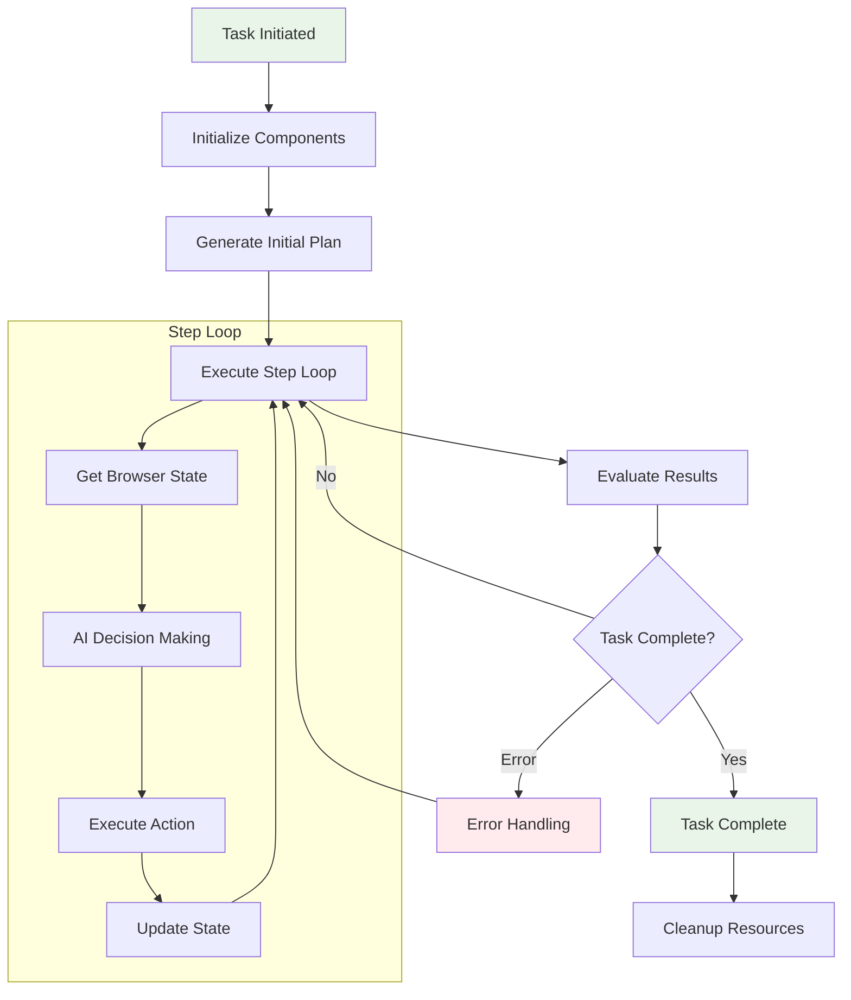

### Detailed Component Integration Flow

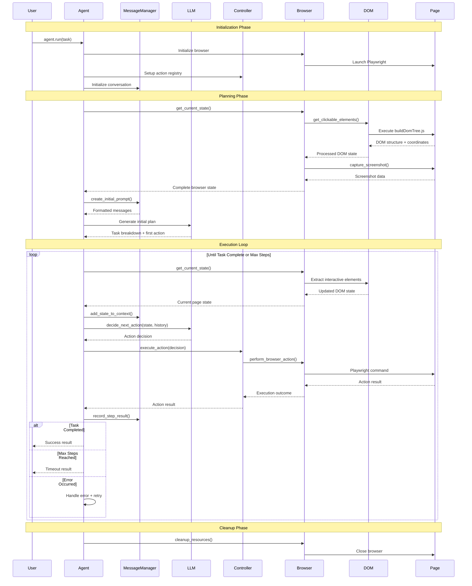

## Component Interaction Patterns

### 1. State Management Pattern

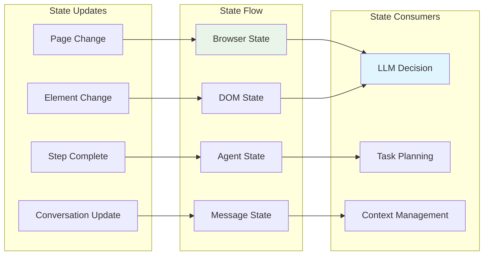

### 2. Error Propagation Pattern

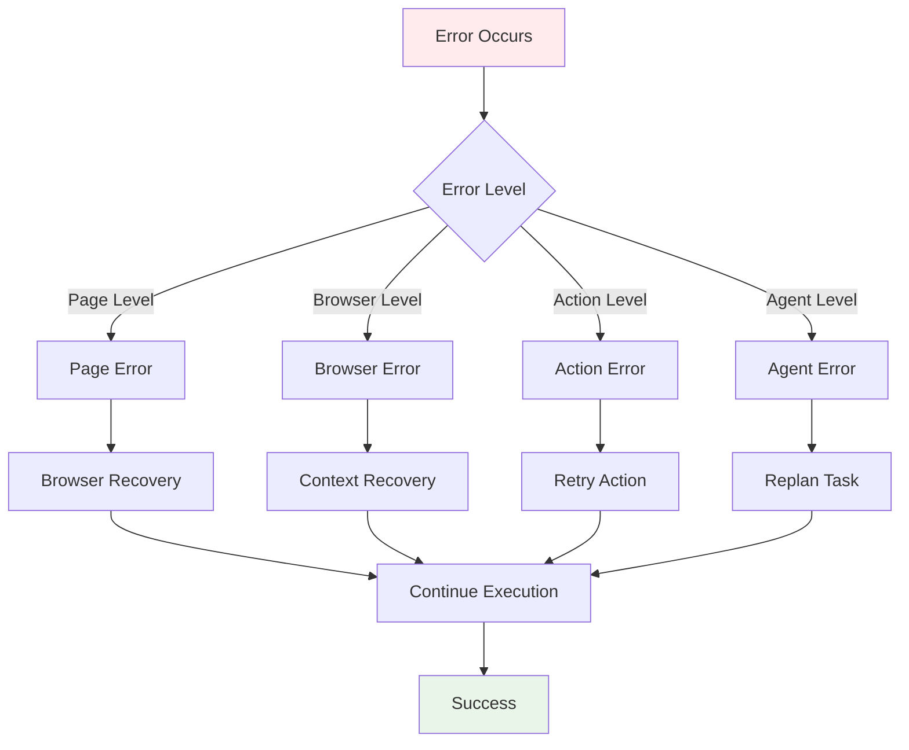

### 3. Memory Management Pattern

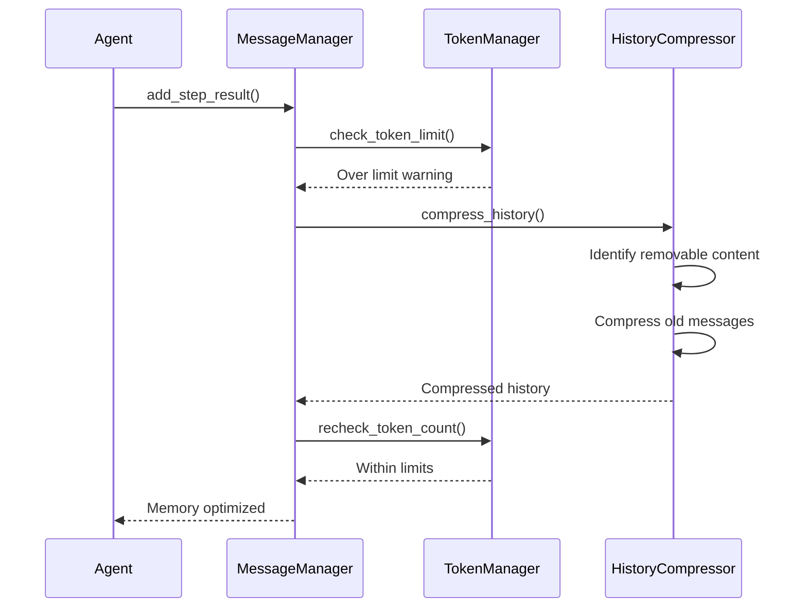

## Specialized Workflow Patterns

### 1. Form Filling Workflow

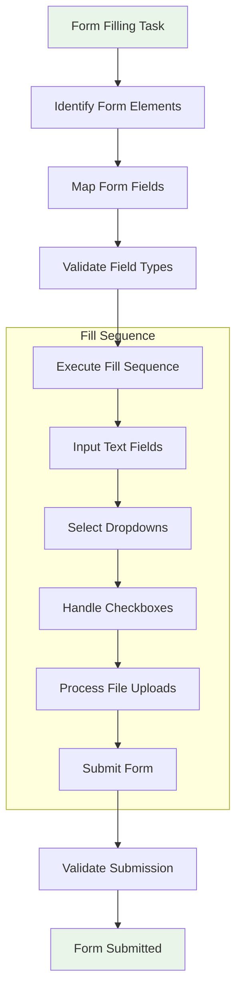

#### Form Filling Implementation

```python
async def form_filling_workflow(agent: Agent, form_data: dict):
    """Specialized workflow for form filling"""
    
    # Step 1: Identify form elements
    state = await agent.browser_context.get_current_state()
    form_elements = identify_form_elements(state.selector_map)
    
    # Step 2: Create filling plan
    fill_plan = create_form_fill_plan(form_elements, form_data)
    
    # Step 3: Execute filling sequence
    for field_action in fill_plan:
        if field_action['type'] == 'input':
            result = await agent.controller.execute_action({
                "input_text": {
                    "index": field_action['index'],
                    "text": field_action['value']
                }
            })
        elif field_action['type'] == 'select':
            result = await agent.controller.execute_action({
                "click_element": {"index": field_action['index']}
            })
        elif field_action['type'] == 'upload':
            result = await agent.controller.execute_action({
                "upload_file": {
                    "index": field_action['index'],
                    "file_path": field_action['file_path']
                }
            })
        
        if result.error:
            raise FormFillingError(f"Failed to fill field: {result.error}")
    
    # Step 4: Submit form
    submit_result = await agent.controller.execute_action({
        "click_element": {"index": form_elements['submit_button']}
    })
    
    return submit_result

def identify_form_elements(selector_map: dict) -> dict:
    """Identify form elements from DOM state"""
    form_elements = {
        'inputs': [],
        'selects': [],
        'checkboxes': [],
        'submit_button': None
    }
    
    for index, element in selector_map.items():
        if element.tag_name.lower() == 'input':
            input_type = element.attributes.get('type', 'text').lower()
            if input_type in ['text', 'email', 'password', 'tel']:
                form_elements['inputs'].append({
                    'index': index,
                    'type': input_type,
                    'name': element.attributes.get('name', ''),
                    'placeholder': element.attributes.get('placeholder', '')
                })
            elif input_type == 'checkbox':
                form_elements['checkboxes'].append(index)
            elif input_type == 'submit':
                form_elements['submit_button'] = index
                
        elif element.tag_name.lower() == 'select':
            form_elements['selects'].append(index)
            
        elif element.tag_name.lower() == 'button':
            button_text = element.get_all_text_till_next_clickable_element().lower()
            if any(word in button_text for word in ['submit', 'send', 'save', 'continue']):
                form_elements['submit_button'] = index
    
    return form_elements
```

### 2. Data Extraction Workflow

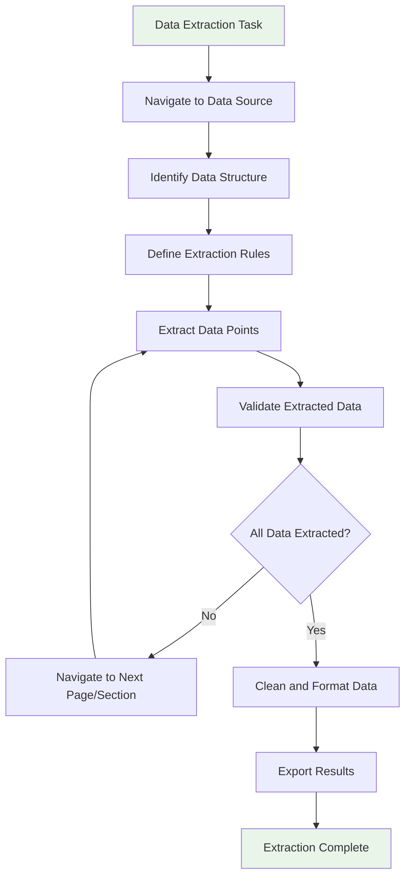

#### Data Extraction Implementation

```python
async def data_extraction_workflow(
    agent: Agent, 
    extraction_config: dict,
    output_format: str = 'json'
) -> dict:
    """Specialized workflow for data extraction"""
    
    extracted_data = []
    current_page = 1
    max_pages = extraction_config.get('max_pages', 10)
    
    while current_page <= max_pages:
        # Get current page state
        state = await agent.browser_context.get_current_state()
        
        # Extract data points from current page
        page_data = await extract_page_data(agent, state, extraction_config)
        extracted_data.extend(page_data)
        
        # Check if more pages exist
        pagination = await find_pagination_controls(state.selector_map)
        if not pagination or not pagination.get('next_button'):
            break
            
        # Navigate to next page
        next_result = await agent.controller.execute_action({
            "click_element": {"index": pagination['next_button']}
        })
        
        if next_result.error:
            break
            
        current_page += 1
        
        # Wait for new page to load
        await asyncio.sleep(2)
    
    # Clean and format extracted data
    cleaned_data = clean_extracted_data(extracted_data, extraction_config)
    
    # Export in requested format
    if output_format.lower() == 'csv':
        return export_to_csv(cleaned_data)
    elif output_format.lower() == 'json':
        return export_to_json(cleaned_data)
    else:
        return cleaned_data

async def extract_page_data(
    agent: Agent, 
    state: BrowserState, 
    config: dict
) -> list:
    """Extract data from current page based on configuration"""
    
    page_data = []
    extraction_rules = config['extraction_rules']
    
    for rule in extraction_rules:
        if rule['type'] == 'list_items':
            # Extract list of similar items
            items = extract_list_items(state.selector_map, rule)
            page_data.extend(items)
            
        elif rule['type'] == 'single_value':
            # Extract single data point
            value = extract_single_value(state.selector_map, rule)
            if value:
                page_data.append(value)
                
        elif rule['type'] == 'table':
            # Extract tabular data
            table_data = extract_table_data(state.selector_map, rule)
            page_data.extend(table_data)
    
    return page_data
```

### 3. Multi-Tab Workflow

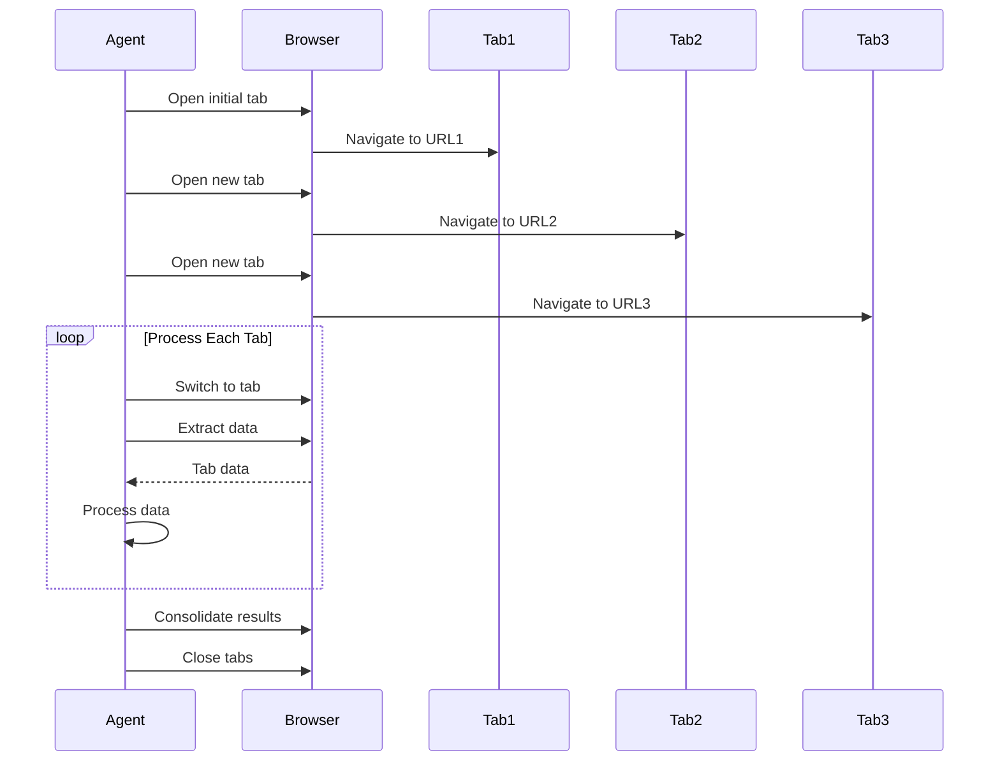

#### Multi-Tab Implementation

```python
async def multi_tab_workflow(agent: Agent, urls: list[str]) -> dict:
    """Process multiple URLs in parallel tabs"""
    
    results = {}
    
    # Open tabs for all URLs
    tab_ids = []
    for url in urls:
        # Open new tab
        await agent.controller.execute_action({
            "open_tab": {"url": url}
        })
        
        # Get current tab info
        state = await agent.browser_context.get_current_state()
        tab_ids.append(len(state.tabs) - 1)  # Last tab
    
    # Process each tab
    for i, tab_id in enumerate(tab_ids):
        # Switch to tab
        await agent.controller.execute_action({
            "switch_tab": {"page_id": tab_id}
        })
        
        # Wait for page load
        await asyncio.sleep(2)
        
        # Extract data from current tab
        state = await agent.browser_context.get_current_state()
        tab_data = await extract_tab_data(state, urls[i])
        results[urls[i]] = tab_data
    
    # Close additional tabs (keep first one)
    for tab_id in reversed(tab_ids[1:]):  # Keep first tab
        await agent.controller.execute_action({
            "switch_tab": {"page_id": tab_id}
        })
        await agent.browser_context.close_tab(tab_id)
    
    return results
```

## Advanced Integration Patterns

### 1. LLM Provider Integration

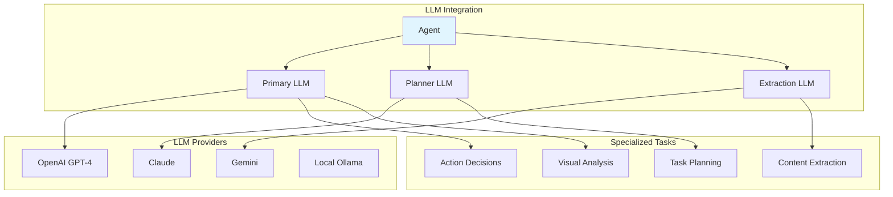

#### Multi-LLM Configuration

```python
from langchain_openai import ChatOpenAI
from langchain_anthropic import ChatAnthropic
from langchain_google_genai import ChatGoogleGenerativeAI

async def advanced_llm_setup():
    """Configure multiple LLMs for specialized tasks"""
    
    # Primary LLM for decision making (vision-capable)
    primary_llm = ChatOpenAI(
        model="gpt-4-turbo",
        temperature=0,
        max_tokens=4000
    )
    
    # Planning LLM for complex reasoning
    planner_llm = ChatAnthropic(
        model="claude-3-sonnet-20240229", 
        temperature=0,
        max_tokens=8000
    )
    
    # Content extraction LLM (cost-effective)
    extraction_llm = ChatGoogleGenerativeAI(
        model="gemini-1.5-flash",
        temperature=0
    )
    
    # Configure agent with specialized LLMs
    agent = Agent(
        task="Complex multi-step automation",
        llm=primary_llm,
        planner_llm=planner_llm,
        page_extraction_llm=extraction_llm,
        planner_interval=3,  # Replan every 3 steps
        use_vision=True,
        use_vision_for_planner=False
    )
    
    return agent
```

### 2. Observability Integration

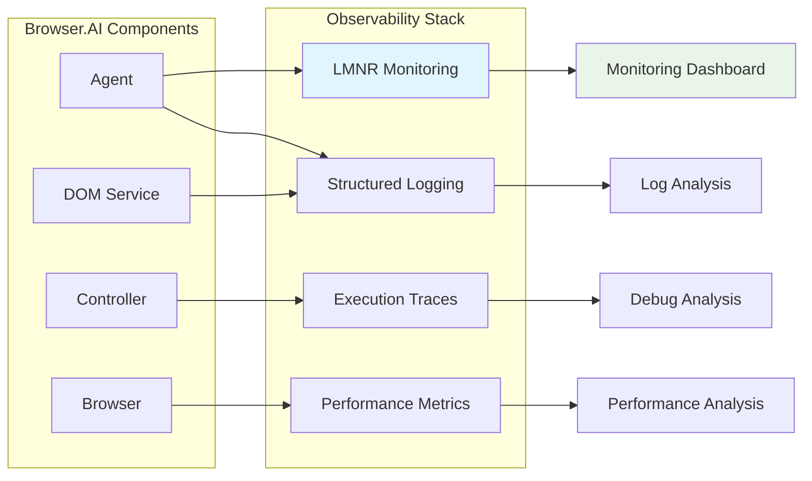

#### Observability Setup

```python
from lmnr import Laminar, observe
import logging

# Configure structured logging
logging.basicConfig(
    level=logging.INFO,
    format='%(asctime)s - %(name)s - %(levelname)s - %(message)s',
    handlers=[
        logging.FileHandler('./logs/browser_ai.log'),
        logging.StreamHandler()
    ]
)

# Initialize LMNR monitoring
Laminar.initialize(project_api_key="your-api-key")

@observe(name="browser_automation_task")
async def monitored_workflow(task_description: str):
    """Workflow with comprehensive monitoring"""
    
    # Initialize components with monitoring
    agent = Agent(
        task=task_description,
        llm=llm,
        register_new_step_callback=log_step_progress,
        register_done_callback=log_task_completion
    )
    
    # Execute with monitoring
    with Laminar.start_span("task_execution") as span:
        span.set_attribute("task", task_description)
        
        result = await agent.run()
        
        span.set_attribute("success", result.is_done)
        span.set_attribute("steps_taken", agent.n_steps)
        
        if result.is_done:
            span.set_attribute("extracted_content", result.extracted_content[:200])
        
        return result

def log_step_progress(state: BrowserState, output: AgentOutput, step: int):
    """Log progress of each step"""
    logger.info(f"Step {step}: {output.action} on {state.url}")
    
    # Send metrics to monitoring
    Laminar.record_event("step_completed", {
        "step_number": step,
        "url": state.url,
        "action_type": str(type(output.action)),
        "elements_found": len(state.selector_map)
    })

def log_task_completion(history: AgentHistoryList):
    """Log task completion metrics"""
    total_steps = len(history.history)
    successful_steps = sum(1 for h in history.history if not h.result.error)
    
    logger.info(f"Task completed: {successful_steps}/{total_steps} successful steps")
    
    # Send completion metrics
    Laminar.record_event("task_completed", {
        "total_steps": total_steps,
        "successful_steps": successful_steps,
        "success_rate": successful_steps / total_steps if total_steps > 0 else 0
    })
```

### 3. Custom Action Integration

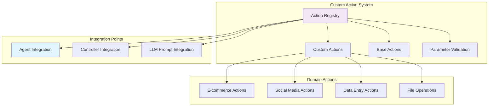

#### Domain-Specific Action Implementation

```python
class ECommerceController(Controller):
    """Specialized controller for e-commerce automation"""
    
    def __init__(self):
        super().__init__(exclude_actions=['search_google'])
        self._register_ecommerce_actions()
    
    def _register_ecommerce_actions(self):
        """Register e-commerce specific actions"""
        
        @self.registry.action(
            'Add product to shopping cart',
            param_model=AddToCartAction
        )
        async def add_to_cart(params: AddToCartAction, browser: BrowserContext):
            # Find and click add to cart button
            state = await browser.get_current_state()
            
            # Look for cart-related buttons
            cart_buttons = find_cart_buttons(state.selector_map)
            if not cart_buttons:
                return ActionResult(error="No add to cart button found")
            
            # Click the most likely cart button
            result = await browser._click_element_node(cart_buttons[0])
            
            return ActionResult(
                extracted_content=f"Added {params.product_name} to cart",
                include_in_memory=True
            )
        
        @self.registry.action(
            'Apply discount code',
            param_model=DiscountCodeAction
        )
        async def apply_discount(params: DiscountCodeAction, browser: BrowserContext):
            # Find discount/promo code input
            state = await browser.get_current_state()
            
            discount_fields = find_discount_fields(state.selector_map)
            if not discount_fields:
                return ActionResult(error="No discount code field found")
            
            # Input discount code
            await browser._input_text_element_node(
                discount_fields['input'], 
                params.code
            )
            
            # Click apply button
            if discount_fields.get('apply_button'):
                await browser._click_element_node(discount_fields['apply_button'])
            
            return ActionResult(
                extracted_content=f"Applied discount code: {params.code}",
                include_in_memory=True
            )
        
        @self.registry.action(
            'Compare product prices across variants',
            param_model=NoParamsAction
        )
        async def compare_prices(params: NoParamsAction, browser: BrowserContext):
            # Extract price information for different variants
            state = await browser.get_current_state()
            
            price_data = extract_price_variants(state.selector_map)
            
            comparison_result = {
                "variants": price_data,
                "cheapest": min(price_data, key=lambda x: x['price']) if price_data else None,
                "most_expensive": max(price_data, key=lambda x: x['price']) if price_data else None
            }
            
            return ActionResult(
                extracted_content=json.dumps(comparison_result),
                include_in_memory=True
            )

# Parameter models for custom actions
class AddToCartAction(BaseModel):
    product_name: str
    quantity: int = 1
    size: Optional[str] = None
    color: Optional[str] = None

class DiscountCodeAction(BaseModel):
    code: str

def find_cart_buttons(selector_map: dict) -> list:
    """Find add to cart buttons in DOM"""
    cart_buttons = []
    
    for element in selector_map.values():
        element_text = element.get_all_text_till_next_clickable_element().lower()
        
        # Check for cart-related text
        cart_keywords = ['add to cart', 'add to bag', 'buy now', 'purchase']
        if any(keyword in element_text for keyword in cart_keywords):
            cart_buttons.append(element)
    
    return sorted(cart_buttons, key=lambda x: len(x.get_all_text_till_next_clickable_element()))

def find_discount_fields(selector_map: dict) -> dict:
    """Find discount code input and apply button"""
    discount_fields = {}
    
    for element in selector_map.values():
        if element.tag_name.lower() == 'input':
            placeholder = element.attributes.get('placeholder', '').lower()
            name = element.attributes.get('name', '').lower()
            
            if any(keyword in placeholder + name for keyword in ['promo', 'discount', 'coupon', 'code']):
                discount_fields['input'] = element
        
        elif element.tag_name.lower() in ['button', 'a']:
            element_text = element.get_all_text_till_next_clickable_element().lower()
            if any(keyword in element_text for keyword in ['apply', 'redeem', 'use code']):
                discount_fields['apply_button'] = element
    
    return discount_fields
```

## Real-World Usage Scenarios

### 1. E-Commerce Product Research

```python
async def ecommerce_research_workflow():
    """Complete e-commerce product research workflow"""
    
    # Configuration
    research_config = {
        "products": ["wireless headphones", "laptop stand", "ergonomic mouse"],
        "sites": ["amazon.com", "bestbuy.com", "newegg.com"],
        "max_results_per_product": 5
    }
    
    # Initialize specialized controller
    controller = ECommerceController()
    
    # Initialize agent with vision capabilities
    agent = Agent(
        task="Research product prices and reviews across multiple sites",
        llm=ChatOpenAI(model="gpt-4-turbo"),
        controller=controller,
        use_vision=True,
        max_failures=5
    )
    
    results = {}
    
    for product in research_config["products"]:
        product_data = {}
        
        for site in research_config["sites"]:
            try:
                # Navigate to site
                await agent.controller.execute_action({
                    "go_to_url": {"url": f"https://{site}"}
                })
                
                # Search for product
                await agent.controller.execute_action({
                    "search_site": {"query": product}
                })
                
                # Extract product information
                site_data = await extract_product_data(
                    agent, 
                    max_results=research_config["max_results_per_product"]
                )
                
                product_data[site] = site_data
                
            except Exception as e:
                logger.error(f"Failed to research {product} on {site}: {e}")
                product_data[site] = {"error": str(e)}
        
        results[product] = product_data
    
    # Generate comparison report
    report = generate_product_comparison_report(results)
    
    return report

async def extract_product_data(agent: Agent, max_results: int) -> list:
    """Extract product data from current page"""
    
    state = await agent.browser_context.get_current_state()
    
    # Find product listings
    product_elements = identify_product_listings(state.selector_map)
    
    products = []
    for i, element in enumerate(product_elements[:max_results]):
        # Click on product to get details
        await agent.controller.execute_action({
            "click_element": {"index": element.highlight_index}
        })
        
        # Wait for product page to load
        await asyncio.sleep(2)
        
        # Extract product details
        detail_state = await agent.browser_context.get_current_state()
        product_info = extract_product_details(detail_state)
        
        products.append(product_info)
        
        # Go back to listings
        await agent.controller.execute_action({
            "go_back": {}
        })
        
        await asyncio.sleep(1)
    
    return products
```

### 2. Social Media Management

```python
class SocialMediaController(Controller):
    """Controller for social media automation"""
    
    def __init__(self):
        super().__init__()
        self._register_social_actions()
    
    def _register_social_actions(self):
        @self.registry.action('Post content to social media', param_model=PostContentAction)
        async def post_content(params: PostContentAction, browser: BrowserContext):
            # Implementation for posting content
            pass
        
        @self.registry.action('Schedule post', param_model=SchedulePostAction)  
        async def schedule_post(params: SchedulePostAction, browser: BrowserContext):
            # Implementation for scheduling posts
            pass

async def social_media_campaign():
    """Automated social media campaign management"""
    
    campaign_config = {
        "platforms": ["twitter.com", "linkedin.com", "facebook.com"],
        "content": [
            {
                "text": "Exciting news about our new product launch!",
                "image": "./images/product1.jpg",
                "schedule": "2024-01-15 09:00:00"
            },
            {
                "text": "Check out our latest blog post on automation",
                "link": "https://example.com/blog/automation",
                "schedule": "2024-01-15 14:00:00"  
            }
        ]
    }
    
    controller = SocialMediaController()
    agent = Agent(
        task="Manage social media campaign",
        llm=ChatOpenAI(model="gpt-4"),
        controller=controller
    )
    
    results = {}
    
    for platform in campaign_config["platforms"]:
        platform_results = []
        
        # Login to platform
        await login_to_platform(agent, platform)
        
        for content in campaign_config["content"]:
            try:
                # Post or schedule content
                if content.get("schedule"):
                    result = await agent.controller.execute_action({
                        "schedule_post": {
                            "content": content["text"],
                            "schedule_time": content["schedule"],
                            "media": content.get("image"),
                            "link": content.get("link")
                        }
                    })
                else:
                    result = await agent.controller.execute_action({
                        "post_content": {
                            "content": content["text"],
                            "media": content.get("image"),
                            "link": content.get("link")
                        }
                    })
                
                platform_results.append({
                    "content": content["text"][:50] + "...",
                    "status": "success" if not result.error else "failed",
                    "error": result.error
                })
                
            except Exception as e:
                platform_results.append({
                    "content": content["text"][:50] + "...",
                    "status": "failed",
                    "error": str(e)
                })
        
        results[platform] = platform_results
    
    return results
```

### 3. Automated Testing Workflow

```python
class TestingController(Controller):
    """Controller for automated testing scenarios"""
    
    def __init__(self):
        super().__init__()
        self._register_testing_actions()
    
    def _register_testing_actions(self):
        @self.registry.action('Validate page element exists', param_model=ValidateElementAction)
        async def validate_element(params: ValidateElementAction, browser: BrowserContext):
            state = await browser.get_current_state()
            
            # Check if element exists with expected properties
            found_element = None
            for element in state.selector_map.values():
                if self._element_matches_criteria(element, params):
                    found_element = element
                    break
            
            if found_element:
                return ActionResult(
                    extracted_content=f"Element found: {params.description}",
                    include_in_memory=True
                )
            else:
                return ActionResult(
                    error=f"Element not found: {params.description}",
                    include_in_memory=True
                )
        
        @self.registry.action('Take screenshot for comparison', param_model=ScreenshotAction)
        async def take_screenshot(params: ScreenshotAction, browser: BrowserContext):
            state = await browser.get_current_state()
            
            # Save screenshot with timestamp
            timestamp = datetime.now().strftime("%Y%m%d_%H%M%S")
            filename = f"screenshot_{params.name}_{timestamp}.png"
            
            # Decode and save screenshot
            screenshot_data = base64.b64decode(state.screenshot)
            with open(f"./screenshots/{filename}", "wb") as f:
                f.write(screenshot_data)
            
            return ActionResult(
                extracted_content=f"Screenshot saved: {filename}",
                include_in_memory=True
            )

async def regression_testing_workflow():
    """Automated regression testing workflow"""
    
    test_cases = [
        {
            "name": "login_functionality",
            "url": "https://example.com/login",
            "steps": [
                {"action": "input_text", "selector": "username", "value": "test_user"},
                {"action": "input_text", "selector": "password", "value": "test_pass"},
                {"action": "click", "selector": "login_button"},
                {"action": "validate", "expected": "dashboard_visible"}
            ]
        },
        {
            "name": "checkout_process", 
            "url": "https://example.com/shop",
            "steps": [
                {"action": "click", "selector": "add_to_cart"},
                {"action": "click", "selector": "cart_icon"},
                {"action": "click", "selector": "checkout_button"},
                {"action": "validate", "expected": "payment_form_visible"}
            ]
        }
    ]
    
    controller = TestingController()
    agent = Agent(
        task="Execute regression test suite",
        llm=ChatOpenAI(model="gpt-4"),
        controller=controller,
        use_vision=True
    )
    
    test_results = []
    
    for test_case in test_cases:
        try:
            # Navigate to test URL
            await agent.controller.execute_action({
                "go_to_url": {"url": test_case["url"]}
            })
            
            # Take initial screenshot
            await agent.controller.execute_action({
                "take_screenshot": {"name": f"{test_case['name']}_start"}
            })
            
            # Execute test steps
            step_results = []
            for i, step in enumerate(test_case["steps"]):
                try:
                    result = await execute_test_step(agent, step)
                    step_results.append({
                        "step": i + 1,
                        "action": step["action"],
                        "status": "passed" if not result.error else "failed",
                        "error": result.error
                    })
                except Exception as e:
                    step_results.append({
                        "step": i + 1,
                        "action": step["action"],
                        "status": "failed",
                        "error": str(e)
                    })
            
            # Take final screenshot
            await agent.controller.execute_action({
                "take_screenshot": {"name": f"{test_case['name']}_end"}
            })
            
            test_results.append({
                "test_case": test_case["name"],
                "status": "passed" if all(s["status"] == "passed" for s in step_results) else "failed",
                "steps": step_results
            })
            
        except Exception as e:
            test_results.append({
                "test_case": test_case["name"],
                "status": "failed",
                "error": str(e)
            })
    
    # Generate test report
    report = generate_test_report(test_results)
    
    return report
```

## Performance Optimization Patterns

### 1. Parallel Execution Pattern

```python
async def parallel_workflow_execution():
    """Execute multiple workflows in parallel"""
    
    # Create separate browser contexts for parallel execution
    browser = Browser()
    
    tasks = [
        ("research_task_1", ["product1", "product2"]),
        ("research_task_2", ["product3", "product4"]), 
        ("research_task_3", ["product5", "product6"])
    ]
    
    # Create agents with separate contexts
    agents = []
    for task_name, products in tasks:
        context = await browser.new_context()
        agent = Agent(
            task=f"Research {len(products)} products",
            llm=ChatOpenAI(model="gpt-4"),
            browser_context=context
        )
        agents.append((agent, products))
    
    # Execute tasks in parallel
    async def execute_task(agent, products):
        results = []
        for product in products:
            result = await research_single_product(agent, product)
            results.append(result)
        return results
    
    # Run all tasks concurrently
    parallel_results = await asyncio.gather(*[
        execute_task(agent, products) for agent, products in agents
    ])
    
    # Cleanup contexts
    for agent, _ in agents:
        await agent.browser_context.close()
    
    await browser.close()
    
    return parallel_results
```

### 2. Caching and State Persistence

```python
class StatefulAgent(Agent):
    """Agent with persistent state and caching"""
    
    def __init__(self, *args, **kwargs):
        super().__init__(*args, **kwargs)
        self.state_cache = {}
        self.result_cache = {}
    
    async def cached_navigation(self, url: str):
        """Navigate with state caching"""
        
        # Check if we're already on this URL
        current_state = await self.browser_context.get_current_state()
        if current_state.url == url and url in self.state_cache:
            logger.info(f"Using cached state for {url}")
            return self.state_cache[url]
        
        # Navigate to URL
        await self.controller.execute_action({
            "go_to_url": {"url": url}
        })
        
        # Cache the new state
        new_state = await self.browser_context.get_current_state()
        self.state_cache[url] = new_state
        
        return new_state
    
    async def cached_extraction(self, extraction_key: str, extraction_func):
        """Extract data with result caching"""
        
        if extraction_key in self.result_cache:
            logger.info(f"Using cached result for {extraction_key}")
            return self.result_cache[extraction_key]
        
        # Perform extraction
        result = await extraction_func()
        
        # Cache result
        self.result_cache[extraction_key] = result
        
        return result
```

## Best Practices Summary

### 1. Error Handling Best Practices

```python
async def robust_workflow_pattern():
    """Template for robust workflow implementation"""
    
    agent = None
    try:
        # Initialize with error handling
        agent = Agent(
            task="Robust automation task",
            llm=llm,
            max_failures=5,        # Allow retries
            retry_delay=15,        # Longer delays for complex tasks
            validate_output=True   # Validate LLM responses
        )
        
        # Execute with checkpoints
        checkpoint_results = []
        
        for i, workflow_step in enumerate(workflow_steps):
            try:
                result = await execute_workflow_step(agent, workflow_step)
                checkpoint_results.append(result)
                
                # Log progress
                logger.info(f"Completed step {i+1}/{len(workflow_steps)}")
                
            except Exception as step_error:
                logger.error(f"Step {i+1} failed: {step_error}")
                
                # Implement recovery strategy
                recovery_result = await attempt_step_recovery(agent, workflow_step, step_error)
                if recovery_result:
                    checkpoint_results.append(recovery_result)
                else:
                    # Decide whether to continue or fail
                    if is_critical_step(workflow_step):
                        raise WorkflowError(f"Critical step {i+1} failed: {step_error}")
                    else:
                        logger.warning(f"Skipping non-critical step {i+1}")
                        checkpoint_results.append(None)
        
        return checkpoint_results
        
    except Exception as e:
        logger.exception(f"Workflow failed: {e}")
        raise
        
    finally:
        # Cleanup resources
        if agent:
            await cleanup_agent_resources(agent)
```

### 2. Resource Management

```python
class ResourceManagedWorkflow:
    """Workflow with comprehensive resource management"""
    
    def __init__(self):
        self.browser = None
        self.contexts = []
        self.temp_files = []
    
    async def __aenter__(self):
        self.browser = Browser()
        return self
    
    async def __aexit__(self, exc_type, exc_val, exc_tb):
        await self.cleanup()
    
    async def create_context(self) -> BrowserContext:
        """Create managed browser context"""
        context = await self.browser.new_context()
        self.contexts.append(context)
        return context
    
    def track_temp_file(self, file_path: str):
        """Track temporary file for cleanup"""
        self.temp_files.append(file_path)
    
    async def cleanup(self):
        """Comprehensive resource cleanup"""
        
        # Close all contexts
        for context in self.contexts:
            try:
                await context.close()
            except Exception as e:
                logger.warning(f"Error closing context: {e}")
        
        # Close browser
        if self.browser:
            try:
                await self.browser.close()
            except Exception as e:
                logger.warning(f"Error closing browser: {e}")
        
        # Clean up temporary files
        for file_path in self.temp_files:
            try:
                if os.path.exists(file_path):
                    os.remove(file_path)
            except Exception as e:
                logger.warning(f"Error removing temp file {file_path}: {e}")
        
        logger.info("Resource cleanup completed")

# Usage
async def managed_workflow():
    async with ResourceManagedWorkflow() as workflow:
        context = await workflow.create_context()
        agent = Agent(task="Managed task", llm=llm, browser_context=context)
        
        # Workflow operations
        result = await agent.run()
        
        return result
    # Automatic cleanup on exit
```

---

*This comprehensive workflows documentation demonstrates how all Browser.AI components integrate to create powerful, robust automation solutions. The patterns and examples provide templates for building sophisticated browser automation workflows.*